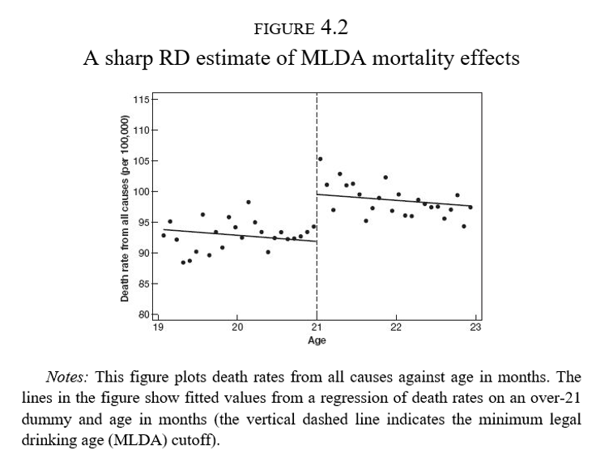
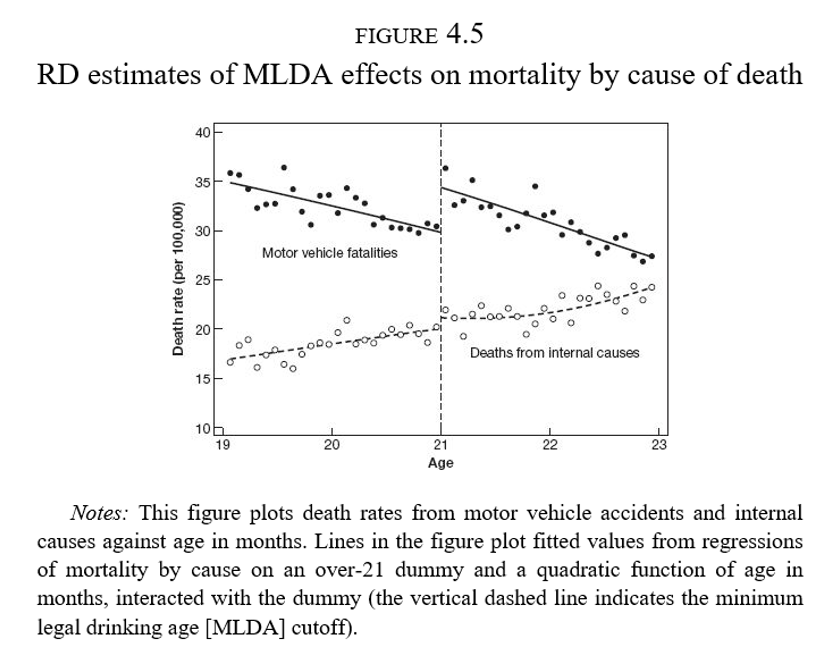
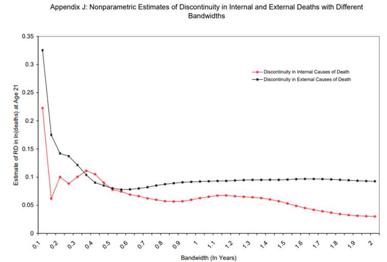
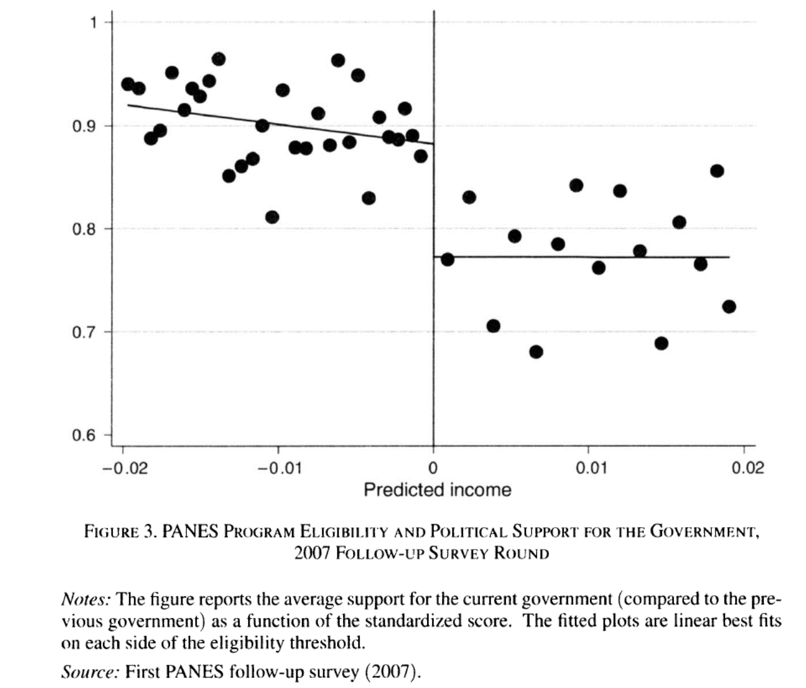
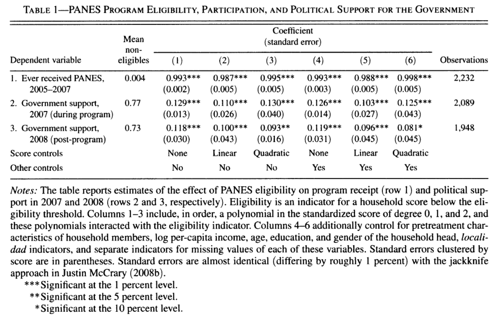
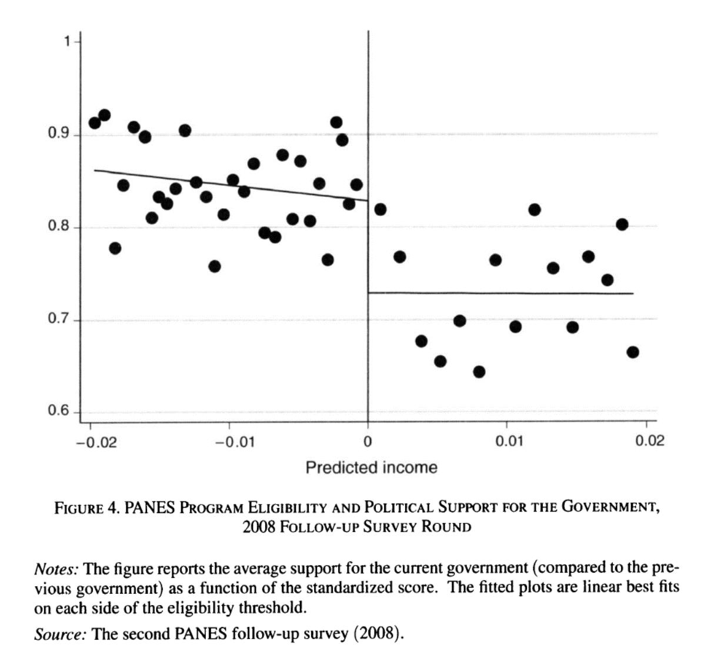

class: title-slide

```{r setup, include=FALSE}
knitr::opts_chunk$set(echo = FALSE, fig.path = "figures/")

library(tidyverse)
library(janitor)
library(sandwich)
#library(nnet)
library(readr)
library(clubSandwich)
library(modelsummary)
library(estimatr)
library(lubridate)
library(lfe)
library(modelsummary)
library(estimatr)

xfun::pkg_load2(c('base64enc', 'htmltools', 'mime'))
```

```{css, echo = FALSE}
.huge .remark-code { /*Change made here*/
  font-size: 200% !important;
}
.tiny .remark-code { /*Change made here*/
  font-size: 60% !important;
}

```

.title[
# Clase 20. Diseños con discontinuidades
]
.subtitle[
## Evaluación de Programas
]
.author[
### Irvin Rojas <br> [rojasirvin.com](https://www.rojasirvin.com/) <br> [<i class="fab fa-github"></i>](https://github.com/rojasirvin) [<i class="fab fa-twitter"></i>](https://twitter.com/RojasIrvin) [<i class="ai ai-google-scholar"></i>](https://scholar.google.com/citations?user=FUwdSTMAAAAJ&hl=en)
]

.affiliation[
### Centro de Investigación y Docencia Económicas <br> División de Economía
]

---

# Motivación

	 
- El mundo está lleno de reglas
 
- Podemos explotar estas reglas para aproximar experimentos
 
- Ejemplos:
	 
  - Índice de pobreza en PROGRESA
  
  - Edad legal para tomar
  
  - Regla de Maimonides
  
  - ... muchas otras

---
	 
# Edad legal para tomar en EU
 
.pull-left[
- En Estados Unidos la edad legal para tomar es de 21 años
 
- ¿Por qué tenemos una ley para prohibir el consumo de alcohol antes de los 21 (o 18) años?
 
- La ley genera una discontinuidad en el acceso a alcohol justo a los 21 años
 
- Podemos evaluar la efectividad de la política
]
 
.pull-right[
```{r, out.width="100%",fig.cap='Fuente: Angrist & Pischke (2014)',fig.align='center'}
knitr::include_graphics("figures/birthdays_funerals.png")
```
]

---

# ¿Qué pasa en el cumpleaños 21?
 
.pull-left[
- ¿Efecto fiesta?
 
- Hay una tendendencia a la baja a ambos lados de la discotinuidad
 
- Sin embargo, hay un claro salto en el número de muertes a los 21 años
]

.pull-right[
```{r, out.width="100%",fig.cap='Fuente: Angrist & Pischke (2014)',fig.align='center'}

```
]

---

class: inverse, middle, center

# Discontinuidades nítidas

---

# Discontinuidades nítidas
 
- $D_a$ es el estado del tratamiento

$$
D_a =
\begin{cases}
1  & \text{si } a \geq 21 \\
0  & \text{si } a < 21
\end{cases}
$$
	 
	 
- $a$ es conocida como *running variable*, *score*, variable de selección, variable de asignación, etc.
 
- El tratamiento es una función determinística de $a$

  - Si conocemos $a$ entonces conocemos $D_a$
 
- El tratamiento es discontinuo sobre $a$

  - No importa qué tanto nos acercamos al corte, el estatus de tratamiento es el mismo hasta $a$
 
  
---

# Discontinuidades níticas y regresión
 
- Muchas cosas cambian con la edad

- Riesgo de enfermedades, muerte por otras causas

- Usamos regresión para aislar los efectos de la regla


$$
\bar{M}_a=\alpha+\rho D_a + \gamma a + \epsilon_a
$$

- $\bar{M}_a$ es la tasa de mortalidad en el mes $a$

- $\rho$ captura el salto en la mortalidad a los 21 años

- $\hat{\rho}=7.66$ : número de muertes adicionales a los 21 años
	
 
  
---

# Diferencia con otros diseños
 
- A diferencia de los métodos de regresión o pareamiento donde controlamos por un vector $X$ y esperamos que el tratamiento sea aleatorio controlando por $X$
 
- Aquí no hay valores de $a$ para los que observemos individuos en ambos estados del tratamiento
 
- La interpretación de la RD es en la vecindad de la discontinuidad
 
---

# No linealidad vs discontinuidad
 
.pull-left[
- Estimar el modelo de RD cuando la relación entre $E[Y|X]$ es como en el tercer panel nos llevaría a inferir un salto donde no existe
 
- Al usar RD debemos asegurarnos que estamos identificando una discontinuidad
 
  - Modelar la no linearidad
  - Concentrarnos solo en una ventana cercana a $a_0$
]
  
.pull-right[
```{r, out.width="80%",fig.cap='Fuente: Angrist & Pischke (2014)',fig.align='center'}
knitr::include_graphics("figures/discontinuity_nonlinearity.png")
```
]

---

# No linealidades
 
- Podemos usar polinomios de $a$

- Idealmente, las conclusiones no deberían cambiar de acuerdo al grado del polinomio usado

- El consejo es intentar varias especificaciones y no solo la que se ajuste más a nuestras expectativas de los resultados

- La Figura 4.2 parece tener una leve curvatura a la derecha de $a$

- Podemos ajustar directamente un polinomio de la edad:


$$
\bar{M}_a=\alpha+\rho D_a + \gamma_1 a + \gamma_2 a^2 + \epsilon_a
$$

--

- O podemos espcificar un coeficiente diferente para $a$ antes y después de $a_0$:


$$
\bar{M}_a=\alpha+\rho D_a + \gamma(a-a_0) + \delta[(a-a_0)D_a] + \epsilon_a
$$
	 

---

# No linealidades

- O podemos espcificar un coeficiente diferente para $a$ antes y después de $a_0$:


$$
\bar{M}_a=\alpha+\rho D_a + \gamma(a-a_0) + \delta[(a-a_0)D_a] + \epsilon_a
$$

--

- Notemos que en este caso el efecto del tratamiento es:
 
$$
\rho+\delta(a-a_0)
$$


- Es decir, un efecto que depende de la distancia con $a_0$

- Sin embargo, ¿qué tan válido es evaluar el efecto en, digamos, $a=30$? ¿O en $a=10$?

---

# No linealidades

- Podemos emplear una combinación de no linearidades y cambios en pendiente:

$$
\begin{aligned}
\bar{M}_a&=\alpha+\rho D_a + \gamma_1(a-a_0) +\gamma_2(a-a_0)^2+\delta_1[(a-a_0)D_a]+ \delta_2[(a-a_0)^2D_a] + \epsilon_a
\end{aligned}
$$

- En esta especificación los términos lineal y cuadrático cambian en $a_0$

- Y el efecto del tratamiento en este caso es:

--

- Notemos que en este caso el efecto del tratamiento es:

$$
\rho+\delta_1(a-a_0)+\delta_2(a-a_0)^2
$$


- En los dos casos anteriores, regularmente se interpreta solo a $\rho$ como el efecto del tratamiento
 
  


---

# No linealidades

.pull-left[
- $\hat{\rho}=9.55$
 
- Modelo más elaborado con mejor ajuste
 
- Es evidente gráficamente que hay un salto a los 21 años y una caída suave después
 
- ¿Qué tan robustos son los resultados?
]
 
  
.pull-right[
```{r, out.width="150%",fig.cap='Fuente: Angrist & Pischke (2014)',fig.align='center'}
knitr::include_graphics("figures/alcohol_sharp_flexible.png")
```
]


---

# Efectos estimados

```{r, out.width="48%",fig.cap='Fuente: Angrist & Pischke (2014)',fig.align='center'}
knitr::include_graphics("figures/RDestimates.png")
```

---

# Efectos estimados

```{r, out.width="65%",fig.cap='Fuente: Angrist & Pischke (2014)',fig.align='center'}

```

---

# Efectos estimados con distintas ventanas
 
- Podemos concentrarnos en *ventanas* cercanas a $a_0$:

$$
\bar{M}_a=\alpha+\rho D_a + \gamma a + \epsilon_a, \quad \quad a_0-b\leq a\leq a_o+b
$$


- Donde $b$ es el ancho de banda

- Hasta ahora usábamos $b=2$

- Las columnas 3 y 4 muestran los resultados al centrar la atención a un año alrededor de $a_0$, es decir, $b=1$

- Un ancho de banda menor implica menos datos y por tanto mayor varianza muestral

- Estimar el modelo con distintos anchos de banda y observar el comportamiento de los estimadores

---

# Efectos estimados con distintas ventanas

```{r, out.width="70%",fig.cap='Fuente: Carpenter & Dobkin (2009)', fig.align='center'}

```

---

class: inverse, middle, center

# Ejemplo: Transferencias gubernamentales y apoyo político

---
# Transferencias gubernamentales y apoyo político

- Manacorda, M., E. Miguel y A. Vigorito (2011), Government Transfers and Political Support

- ¿Los programas gubernamentales generan lealtades?

- Programa Nacional de Emergencia Social (PANES) basado en un índice de pobreza 

- Existe una discontinudad en el acceso al programa
 
  
---

# Contexto
 
- ¿Qué pasó en Uruguay?
 
- Crisis económica a inicios de los 2000
 
- En abril de 2005 el Frente Amplio toma el poder
 
- Expansión del gasto público contra la pobreza (0.41% del PIB)
 
- PANES
	 
  - Ingreso ciudadano: US$70
   
  - Otros componentes: alimenticio, empleo, salud, etc.
   
  - Alcanzó al 10% de los hogares y 14% de la población
		 

---

# Regla de asignación
 
- ¿Cómo se decidió quién recibiría el PANES?

- Focalizado a los más pobres

- Modelo probit de ingreso ajustado

- El ingreso observado puede ser un indicador muy ruidoso

- Se asignó el programa solo a aquellos por debajo de un umbral de ingreso ajustado

---

# Datos

.pull-left[
- Se recolectó información de los hogares alrededor de la discontinuidad (tratados y no tratados)
 
- Se realizaron dos rondas de seguimiento en 2006-07 y en 2008
 
- Variable de interés: apoyo político al gobierno en turno
]

.pull-right[
```{r, out.width="100%",fig.cap='Fuente: Manacorda et al. (2011)',fig.align='center'}
knitr::include_graphics("figures/PANES_implementation.png")
```
]
---

# ¿Cómo medir el apoyo político?
 
- Construcción de un índice del 0 al 1
 
- Los hogares que reciben PANES tenían un apoyo político cercano a 0.90
 
- Los no elegibles mostraban un apoyo de 0.77
 
- Esto implica un incremento de 13 puntos porcentuales
 
---

# Evidencia gráfica
 
```{r, out.width="55%",fig.cap='Fuente: Manacorda et al. (2011)',fig.align='center'}

```

---

# Resultados de regresión
 
- $E$ es el umbral de elegibilidad de PANES

- $N_i=S_i-E$ es el score normalizado


$$
y_i=\beta_0+\beta_1 \mathcal{I}(N_i<1) + f_1(N_i) + \mathcal{I}f_2(N_i)+u_i
$$


- $\beta_1$ captura el impacto del programa
 
---

# Efectos estimados

 
```{r, out.width="70%",fig.cap='Fuente: Manacorda et al. (2011)',fig.align='center'}

```

---

# Evidencia gráfica en 2008

```{r, out.width="50%",fig.cap='Fuente: Manacorda et al. (2011)',fig.align='center'}

```
  
---

# Robustez

```{r, out.width="60%",fig.cap='Fuente: Manacorda et al. (2011)',fig.align='center'}
knitr::include_graphics("figures/PANES_validation.png")
```

---

# Interpretación
 
- Se descarta una interpretación de votantes miopes
 
- Se descartan efectos de largo plazo pues no hay efectos significativos en activos

- Modelo teórico

  - Agentes racionales que aprenden de las preferencias de los políticos
  

---

class: inverse, middle, center

# Discontinuidades nítidas: resumen

---

# Discontinuidades nítidas: resumen
 
- RD nítida se usa cuando el tratamiento es una función determinística de una variable $x$


$$
D_i =
\begin{cases}
1  & \mbox{if } x_i \geq x_0 \\
0  & \mbox{if } x_i < x_0
\end{cases}
$$


- $x_0$ es el *umbral* o *corte*

- $D_i$ es una función determinística de $x_i$ pues una vez que conocemos $x_i$ entonces conocemos $D_i$

- $D_i$ es una función discontinua en $x_i$ pues no importa que tanto nos acerquemos por la izquierda o por la derecha a $x_0$, el estado del tratamiento no cambia
	
---

# Discontinuidades nítidas: resumen
 
- A diferencia de los modelos de regresión o de pareamiento, no hay valor de $x_i$ en el que observemos a individuos tratados y no tratados
 
- La interpretación del efecto estimado por RD es un efecto local en la vecindad de $x_0$, donde podemos tener confianza que los individuos tratados y no tratados son similares en todas las dimensiones excepto en su posición respecto a $x_0$
 
- Una especificación flexible permite no confundir una discontinuidad con una no linealidad
 
- En la práctica, el polinomio de $x_i$ puede ser tan complejo como se desee pero se espera que los resultados no sean muy sensibles a especificaciones de este
 
- El método no paramétrico consiste en la estimación de $\rho$ en vecindades cada vez más pequeñas alrededor de $x_0$


---

# Próxima clase

- Lecturas adicionales sugeridas:

  - Lee, D. S., & Lemieux, T. (2010). Regression discontinuity designs in economics. *Journal of economic literature*, 48(2), 281-355.
  
  - Imbens, G. W., & Lemieux, T. (2008). Regression discontinuity designs: A guide to practice. *Journal of econometrics*, 142(2), 615-635.

- Otro ejemplo

  - Del Valle, A., de Janvry, A., & Sadoulet, E. (2020). Rules for recovery: Impact of indexed disaster funds on shock coping in Mexico. *American Economic Journal: Applied Economics*, 12(4), 164-95.

- Introduciremos los diseños con discontinudades difusas

  - Ver MT, sección 6.2.7

---

class: center, middle

Presentación creada usando el paquete [**xaringan**](https://github.com/yihui/xaringan) en R.

El *chakra* viene de [remark.js](https://remarkjs.com), [**knitr**](http://yihui.org/knitr), y [R Markdown](https://rmarkdown.rstudio.com).

Material de clase en versión preliminar.

**No reproducir, no distribuir, no citar.**


