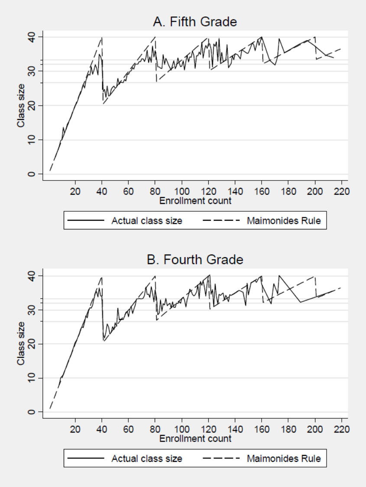
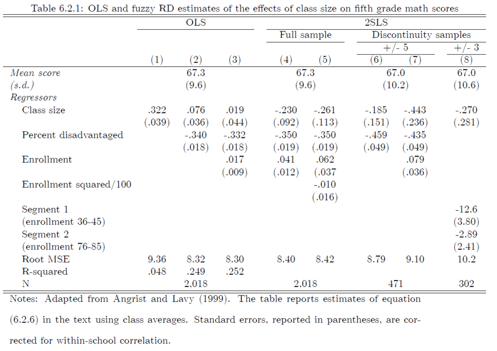
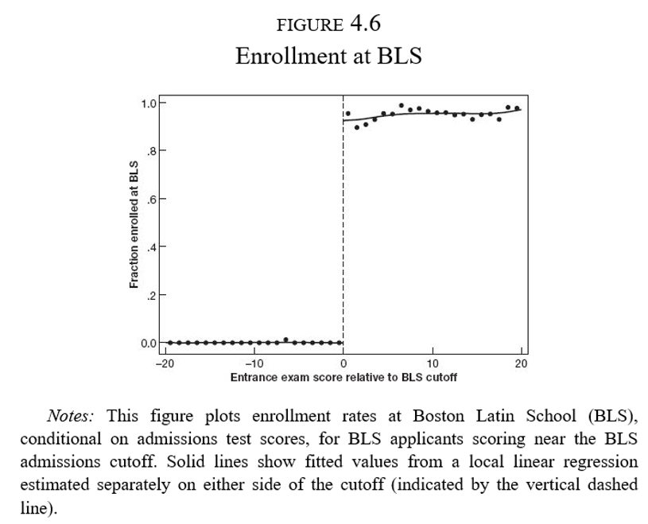
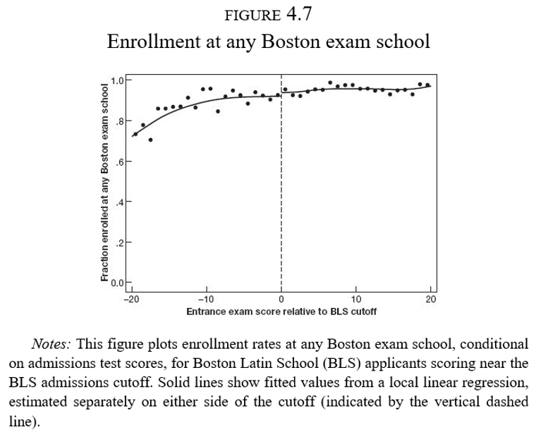
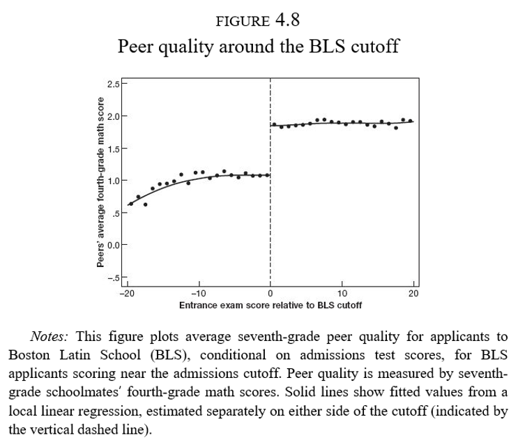
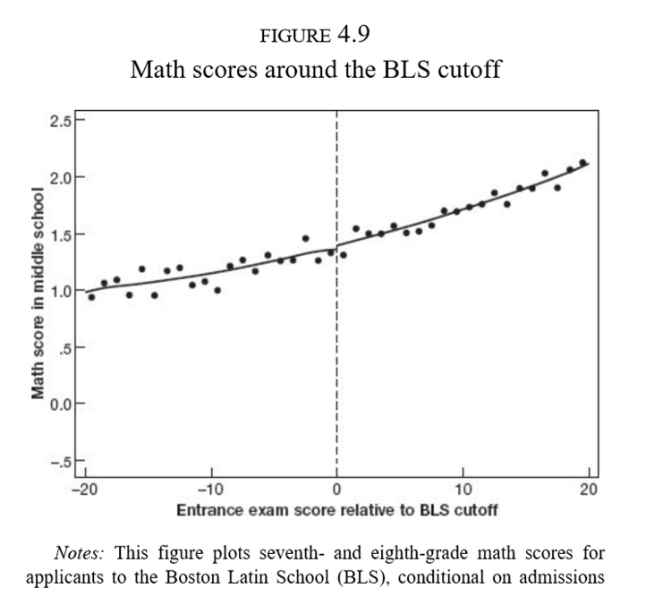

class: title-slide

```{r setup, include=FALSE}
knitr::opts_chunk$set(echo = FALSE, fig.path = "figures/")

library(tidyverse)
library(pacman)
library(janitor)
library(sandwich)
#library(nnet)
#library(mlogit)
library(readr)
library(clubSandwich)
library(modelsummary)
library(estimatr)
library(lubridate)
library(ExPanDaR) #for describing panel data
library(lfe)
library(modelsummary)
library(estimatr)
library(Matching)
library(MatchIt)
library(Zelig)

p_load(tidyverse, foreign, reshape2, psych, qwraps2, forcats, readxl, 
       broom, lmtest, margins, plm, rdrobust, multiwayvcov,
       wesanderson, sandwich, stargazer,
       readstata13, pscore, optmatch, kdensity, MatchIt, bootstrap, matlib, dplyr)

xfun::pkg_load2(c('base64enc', 'htmltools', 'mime'))
```

```{css, echo = FALSE}
.huge .remark-code { /*Change made here*/
  font-size: 200% !important;
}
.tiny .remark-code { /*Change made here*/
  font-size: 60% !important;
}

```

.title[
# Clase 21. Discontinuidades difusas
]
.subtitle[
## Evaluación de Programas
]
.author[
### Irvin Rojas <br> [rojasirvin.com](https://www.rojasirvin.com/) <br> [<i class="fab fa-github"></i>](https://github.com/rojasirvin) [<i class="fab fa-twitter"></i>](https://twitter.com/RojasIrvin) [<i class="ai ai-google-scholar"></i>](https://scholar.google.com/citations?user=FUwdSTMAAAAJ&hl=en)
]

.affiliation[
### Centro de Investigación y Docencia Económicas <br> División de Economía
]

---


# Motivación

- Los diseños con discontinuidades nos permiten explotar cambios discretos en la elegibilidad y/o participación en programas o intervenciones basadas en una regla

- Las regresiones nítidas implican que $D_i$ es determinística con respecto al corte $x_0$

- Cuando la relación no es determinística, otras diseños son posibles de implementar

---
class: middle, inverse, center

# Discontinuidad en la regresión difusa

---

# Discontinuidad en la regresión difusa
 
- Hasta ahora hemos tratado con una regla determinística que determina el tratamiento en función de la variable de asignación

- Alrededor de una regla de asignación puede haber individuos que decidan o no participar

- En este caso, la discontinuidad afecta la intensidad del tratamiento o las probabilidades de recibirlo, en vez de generar un simple encendido-apagado
 
  
---

# La relga de Maimonides
 
 - Angrist, J. D., y Lavy, V. (1999), Using Maimonides' rule to estimate the effect of class size on scholastic achievement

- ¿Efecto del tamaño de clase en el desempeño de los alumnos?

- Un problema fundamental en la economía de la educación

- La regla de Maimonides permite generar variación útil para resolver esta pregunta

--

> *"Un maestro estará a cargo de 25 niños. Si el número de niños en la clase excede 25 pero no es mayor que 40, deberá tener un asistente para ayudarle en la clase. Si hay más de 40, se deberán asignar dos maestros."*
>
> --- Maimonides, Capítulo 2, Las reglas del estudio de la Torá, Mishné Torá.

---

# Tamaño de la clase en Israel
 
.pull-left[
- En Israel, el tamaño de la clase está limitado a 40 estudiantes
 
- Grados con 41 estudiantes son partidas en dos grupos
 
- Grados con 81 estudiantes son partidas en tres grupos

$$
m_{sc}=\frac{e_s}{int\left[\frac{(e_s-1)}{40}+1\right]}
$$
]

.pull-right[
```{r, out.width="70%",fig.cap='Fuente: Angrist & Pischke (2009)',fig.align='center'}

```
]
  
---

# RD difusa + VI
 
- Se estima una ecuación por MC2E:

$$Y_{isc}=\alpha_0+ \alpha_1 d_s +\beta_1 e_s + \beta_2 e_s^2+\ldots+\beta_p e_s^p + \rho n_{sc} + \nu_{isc}$$


- Donde $Y_{isc}$ es la calificación en una prueba de matemáticas del estudiante $i$ en la escuela $s$ y en el grupo $c$

- $n_{sc}$ es el tamaño del grupo

- $m_{sc}$ es el tamaño del gropo que predice la regla de Maimonides y se usa como instrumento de $n_{sc}$

- $e_s$ es el número de alumnos, el *score* de esta aplicación

- $d_s$ proporción de estudiantes desaventajados (no es estrictamente necesario para el RD, es un control)

  
---

# $m_{sc}$ como VI
 
- $m_{sc}$ no predice el tamaño de clase de forma perfecta

- Este instrumento implícitamente combina la discontinuidades y los cambios de pendiente en cada discontinuidad de una forma compacta

- En otras aplicaciones esto se logra parametrizando las funciones de manera flexible

---

# Efectos estimados

```{r, out.width="70%",fig.cap='Fuente: Angrist & Pischke (2009)',fig.align='center'}

```

---

class: inverse, middle, center

# La ilusión de la élite

---

# La ilusión de la élite
 
- Escuelas de élite, *exam schools*, altamente competitivas en Nueva York y Boston
 
- Bajas tasas de admisión
 
- ¿Cómo diferenciar el valor agregado de la escuela del hecho de que la acta selectividad hace que a estas escuelas asistan solo los alumnos más brillantes?
 
- ¡Ojalá pudiéramos asignar alumnos al azar!
 
- Los estudiantes en estas escuelas de élite comparten clases con estudiantes aventajados
 
 
---

# La regla de asignación

.pull-left[
- Cada escuela tiene un *corte* de puntaje de admisión
 
- En la escuela más competitiva de Boston aquellos estudiantes debajo del corte nunca asisten a dicha escuela
 
- Los que están arriba del corte casi siempre acaban en la BLS
]

.pull-right[
```{r, out.width="100%",fig.cap='Fuente: Angrist & Pischke (2014)',fig.align='center'}

```
]
---

# La regla de asignación 

.pull-left[
- Sin embargo, aquellos que no alcanzan el puntaje mínimo de la BLS acaban de cualquier forma en una escuela de élite
]

.pull-right[
```{r, out.width="100%",fig.cap='Fuente: Angrist & Pischke (2014)',fig.align='center'}

```
]
---

# La regla de asignación

.pull-left[
- Hay una dimensión que genera una discontinuidad: efectos de pares o *peer effects*
 
- Es una de las preocupaciones más importantes de política educativa en casi cualquier país
 
- Tener buenos (malos) compañeros afecta los resultados del individuo $i$
 
- Quienes ingresan a la BLS (séptimo grado) tuvieron compañeros con mejor desempeño en matemáticas cuando iban en cuarto grado
]

.pull-right[
```{r, out.width="100%",fig.cap='Fuente: Angrist & Pischke (2014)',fig.align='center'}

```
]
---

# Modelo de efectos de pares
 
- Un modelo de efectos de pares:
 
 
$$Y_i=\theta_0+\theta_1\bar{X}_{(i)}+\theta_2 X_i + u_i$$
 
 
- $Y_i$ es el resultado de un examen de matemáticas en el séptimo año del individuo $i$
 
- $X_i$ es el resultado de un examen de matemáticas en el cuarto año del individuo $i$
 
- $\bar{X}_{(i)}$ es el resultado promedio de un examen de matemáticas en el cuarto año de los compañeros de $i$ sin incluir $i$
 
- Otra notación en la literatura escribe esto como $\bar{X}_{(-i)}$
 
- Los resultados están estandarizados por lo que los coeficientes se interpretan en términos de desviaciones estándar: $\hat{\theta}_1=0.25\sigma$
 
 
---

# RD difuso + VI
 
- Problemas
 
  - Sabemos que en la discontinuidad, la calidad de los pares cambia drásticamente
   
  - Características de los hogares (habilidad de los padres)
   
  - Doble causalidad: $i$ afecta a $j$ pero $j$ afecta a $i$ a la vez
		 

--

- Variables instrumentales:
 
   
  - Queremos conocer el efecto de la calidad de los pares en el desempeño de matemáticas
   
  - Usamos el corte mínimo para ser aceptado en BLS como instrumento de la calidad de los pares
		 
 
---

# Forma reducida

.pull-left[
- Si solo usamos el corte para ser aceptado en BLS:
	 
 
$$Y_i=\alpha_0+\rho D_i + \beta_0 R_i + \epsilon_i$$
 
 
- Se obtiene $\hat{\rho}=-0.02$, $s.e.=0.10$
 
- Este es un modelo de forma reducida (variable de interés en función de la posición respecto al corte)
 
- Es el efecto causal de estar antes o después del corte
]

.pull-right[
```{r, out.width="100%",fig.cap='Fuente: Angrist & Pischke (2014)',fig.align='center'}

```
]
---

# Modelo de VI
 
- Modelo estructural:
 
 
$$Y_i=\alpha_2+\lambda \bar{X}_{(i)} + \beta_2 R_i + \epsilon_{2i}$$
 
 
- Con una primera etapa
 
	 
$$\bar{X}_{(i)}=\alpha_1 + \phi D_i + \beta_1 R_i + \epsilon_{1i}$$
 
 
- En la primera etapa $\hat{\phi}=0.80\sigma$, como lo habíamos visto ya en la Figura 4.8
  
- En la segunda etapa $\hat{\lambda}=-0.023$, $(s.e.=0.13)$
 
---

# Modelo de VI

```{r, out.width="54%",fig.cap='Fuente: Angrist & Pischke (2014)',fig.align='center'}

```
---

# La ilusión

- No hay tal ganancia por compartir clase con alumnos *brillantes*

- La gente sigue percibiendo que sus hijos ganan al ir a escuelas de élite

- Posiblemente los egresados de estas escuelas tengan mayores ingresos

- Las ganancias que se puedan obtener no son vía el efecto de pares o un mejor rendimiento cognitivo

---

class: middle, inverse, center

# RD difusa: resumen

---

# RD difusa: resumen
 
- RD difusa explota discontinuidades en la probabilidad o valor esperado del tratamiento condicional en una variable

- El resultado es que la discontinuidad se convierte en una VI para el estado del tratamiento en vez de una variable que se prende y apaga

$$
P(D_i =1|x_i)=
\begin{cases}
g_1(x_i)  & \mbox{if } x_i \geq x_0 \\
g_0(x_i)  & \mbox{if } x_i < x_0
\end{cases}
$$

- Las funciones $g_0$ u $g_1$ difieren en $x_0$

- Supongamos que $g_1(x_0)>g_0(x_0)$, es decir, $x_i\geq x_0$ hace el tratamiento más probable

---

# RD difusa: resumen

- La relación entre el estado de tratamiento y $x_i$ puede ser escrita como:

$$E(D_i|x_i)=P(D_i=1|x_i)=g_0(x_i)+[g_1(x_i)-g_0(x_i)]T_i$$

con $T_i=\mathcal{I}(x_i\geq x_0)$

- Escribiendo las funciones $g_0$ y $g_1$ como polinomios flexibles de $x_i$

$$E(D_i|x_i)=\gamma_{00}+\gamma_{01}x_i+\gamma_{02}x_i+\ldots+\gamma_{0p}x_i^p +\pi T_i + \gamma_{1}^{*}x_i T_i+ \gamma_{2}^{*}x_i^2 T_i+\ldots+ \gamma_{p}^{*}x_i^p T_i$$

---

# RD difusa: resumen
 
- En la primera etapa podríamos $\{x_iTi, x_i^2 T_i,...,x_i^p T_i\}$ como instrumentos para $D_i$

- Una primera etapa con interacciones sugeriría emplear una segunda etapa también con interacciones

- La versión más simple solo $T_i$ como instrumento

- La primera etapa será

$$D_i=\gamma_0+\gamma_1 x_i + \gamma_2 x_i^2 + \ldots + \gamma_p x_i^p + \pi T_i + \xi_{i}$$


- La forma reducida de este modelo es:

$$y_i=\beta_0+\beta_1 x_i + \beta_2 x_i^2 + \ldots + \beta_p x_i^p + \delta\ D_i + u_{i}$$

---

# Próxima sesión

- Veremos tres ejemplos de diseños con discontinuidades

  + Del Valle, A., de Janvry, A., & Sadoulet, E. (2020). Rules for recovery: Impact of indexed disaster funds on shock coping in Mexico. *American Economic Journal: Applied Economics*, 12(4), 164-95.

  + Dell, M. (2015). Trafficking networks and the Mexican drug war. *American Economic Review*, 105(6), 1738-79.

  + Aguilar, A., Gutierrez, E., & Seira, E. (2021). The effectiveness of sin food taxes: Evidence from Mexico. *Journal of Health Economics*, 77, 102455.

- Finalmente replicaremos en R:

  + Anagol, S., & Fujiwara, T. (2016). The runner-up effect. *Journal of Political Economy*, 124(4), 927-991.
  
---

class: center, middle

Presentación creada usando el paquete [**xaringan**](https://github.com/yihui/xaringan) en R.

El *chakra* viene de [remark.js](https://remarkjs.com), [**knitr**](http://yihui.org/knitr), y [R Markdown](https://rmarkdown.rstudio.com).

Material de clase en versión preliminar.

**No reproducir, no distribuir, no citar.**


