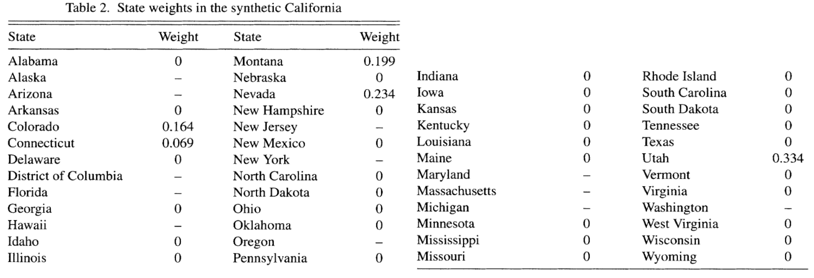
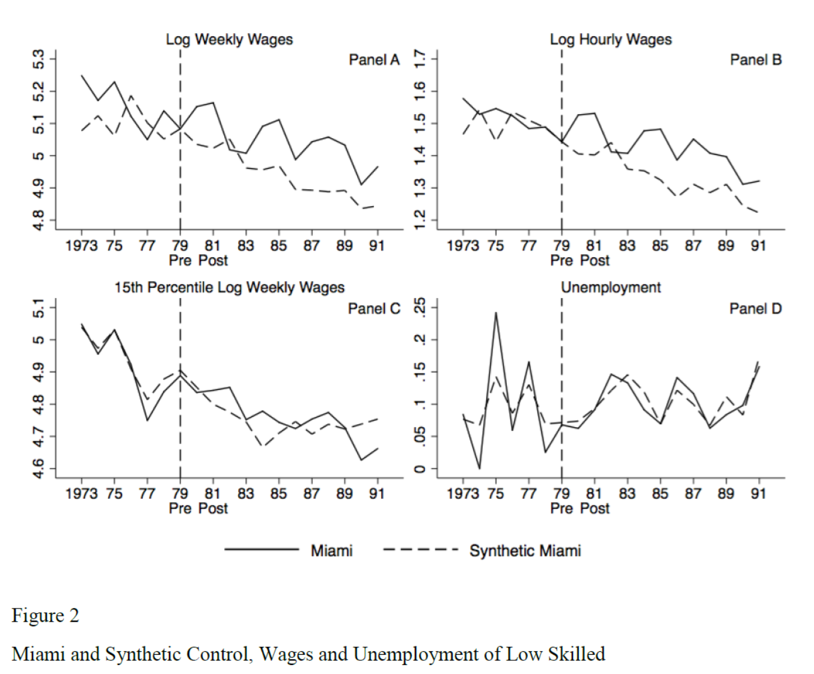

class: title-slide

```{r setup, include=FALSE}
knitr::opts_chunk$set(echo = FALSE, fig.path = "figures/")

library(tidyverse)
library(pacman)
library(janitor)
library(sandwich)
#library(nnet)
#library(mlogit)
library(readr)
library(clubSandwich)
library(modelsummary)
library(estimatr)
library(lubridate)
library(ExPanDaR) #for describing panel data
library(lfe)
library(modelsummary)
library(estimatr)
#library(Matching)
#library(MatchIt)
#library(Zelig)
library(gtsummary)
library(stargazer)

xfun::pkg_load2(c('base64enc', 'htmltools', 'mime'))
```

```{css, echo = FALSE}
.huge .remark-code { /*Change made here*/
  font-size: 200% !important;
}
.tiny .remark-code { /*Change made here*/
  font-size: 60% !important;
}
```

.title[
# Clase 24. Control sintético
]
.subtitle[
## Evaluación de Programas
]
.author[
### Irvin Rojas <br> [rojasirvin.com](https://www.rojasirvin.com/) <br> [<i class="fab fa-github"></i>](https://github.com/rojasirvin) [<i class="fab fa-twitter"></i>](https://twitter.com/RojasIrvin) [<i class="ai ai-google-scholar"></i>](https://scholar.google.com/citations?user=FUwdSTMAAAAJ&hl=en)
]

.affiliation[
### Centro de Investigación y Docencia Económicas <br> División de Economía
]

---

# Motivación
 
- Hasta ahora hemos usado situaciones en las que varios individuos resultan tratados y varios resultan no ser tratados
 
- Los métodos no experimentales nos permiten identificar el efecto de un tratamiento por medio de supuestos
 
- Tratamos de aproximar una situación experimental
 
- Los estudios de evento ocurren cuando una política o programa se lleva a cabo a nivel agregado y afecta a unas pocas (a veces una) unidades
 
---

# Motivación

- El método de *control sintético* (CS) ha sido empleado para estudiar el efecto de algunas políticas (o eventos):
 
  - El impacto del terrorismo en la región de Cataluña

  - El efecto de una legislación contra el tabaco en California

  - El efecto sobre el crecimiento de la reunificación de Alemania

  - El efecto del flujo masivo de inmigrantes a Miami

 
 
---
 
# Partimos del concepto de DID

- Consideremos un modelo simple de diferencia en diferencias

- Observamos una unidad tratada y una que nunca lo fue antes y después del tratamiento

- Bajo ciertos supuestos, el estimador de DID es el efecto del tratamiento

- La implementación consiste en comparar la unidad tratada con una o varias no tratadas
	 
---

# ¿Cuál es el efecto de la inmigración en los mercados laborales?

- Card (1990) empleó datos a nivel individual sobre salarios y empleo en el área metropolitana de Miami y los comparó con el promedio de otras cuatro ciudades con proporciones similares de hispanos y negros

- Al comparar las tendencias en empleo y salarios con las de este conjunto de ciudades Card concluye que la llegada de inmigrantes no tuvo ningún efecto negativo

---

# Los marieles

```{r, out.width="80%",fig.cap='Fuente: Tomada de internet',fig.align='center'}
knitr::include_graphics("figures/marieles_newspaper.jpg")
```
---

# Los marieles
	 
.pull-left[
- ¿Cuál es el efecto de la inmigración en los mercados laborales?

- Card (1990) empleó datos a nivel individual sobre salarios y empleo en el área metropolitana de Miami y los comparó con el promedio de otras cuatro ciudades con proporciones similares de hispanos y negros

- Se compara a Miami con el promedio de Atlanta, Houston, Los Angeles y Tampa
]

.pull-right[
```{r, out.width="50%",fig.cap='Fuente: Card (1990)',fig.align='center'}
knitr::include_graphics("figures/Miami_immigrants_characteristics.png")
```
]

---

# Los marieles

```{r, out.width="70%",fig.cap='Fuente: Card (1990)',fig.align='center'}

```

---

# Los marieles

```{r, out.width="70%",fig.cap='Fuente: Card (1990)',fig.align='center'}
knitr::include_graphics("figures/Miami_unemployment_comparison.png")
```

---

# Los marieles
	 
- Al comparar las tendencias en empleo y salarios con las de este conjunto de ciudades Card concluye que la llegada de inmigrantes no tuvo ningún efecto negativo

- Tampoco encuentran evidencia de que la distribución de ingresos de los no cubanos se hubiera hecho más desigual

- Tampoco hubo efectos concentrados en los grupos menos educados

- Se concluye que Miami tuvo la capacidad para absorber el choque de oferta de trabajo sin efectos en el resto del empleo

---

# Otro ejemplo clásico de DID
	 
- El ejemplo clásico del modelo de DID es el estudio del efecto del salario mínimo en el empleo

- Card y Krueger (1994) comparan los niveles de empleo en restaurantes de comida rápida en Nueva Jersey y Filadelfia

- La intuición es que estas dos áreas eran muy similares antes de la subida del salario mínimo en Nueva Jersey

- Por lo tanto, comparando las variables de resultados entre ciudades, antes y después de la subida del salario mínimo, podemos obtener el efecto del tratamiento
	 
- Los autores no encuentran evidencia de que la subida del salario mínimo redujera el empleo

---

# Crítica a DID

- ¿Cómo escogemos las unidades de comparación?

- ¿Cómo podemos saber qué tan buena es la unidad de comparación como contrafactual para reproducir lo que le hubiera pasado a la unidad tratada de no haber recibido el tratamiento?
	 
---

# Extender DID sistemáticamente
	 
- El CS permite estudiar sistemáticamente estudios de eventos

- En otras ciencias sociales los estudios de eventos regularmente se realizan mediante un análisis detallado de las condiciones institucionales, políticas e históricas de la unidad tratada

- El CS nos permite seleccionar sistemáticamente las unidades de comparación

- Con las características de las unidades no tratadas se construye una unidad sintética que se emplea para compararla con la unidad tratada y medir el efecto del tratamiento

- Se trata de crear una unidad sintética que representa a la unidad tratada como si no hubiera recibido el tratamiento
	 
---

# ¿Lo único que podemos hacer son estudios cualitativos?

```{r, out.width="75%", fig.align='center'}
knitr::include_graphics("figures/marieles_castro.jpg")
```

---

class: middle, inverse, center

# El modelo

---

# El modelo
 
- Tenemos $J+1$ unidades, siendo ${2,...,J+1}$ las no tratadas

- $t=1,...,T$ periodos

- En $T_0$ ocurre una intervención que solo afecta a $1$

- $Y_{it}^I$ es un individuo intervenido, $Y_{it}^N$ es un indivudo no intervenido

- Asumimos que antes de la intervención, ninguna unidad fue afectada: $Y_{it}^N=Y_{it}^I \quad \forall i,t < T_0$

- El efecto del tratamiento en es:

$$\alpha_1=\left(\alpha_{1T_0+1},..., \alpha_{1T}\right)$$
 
con $t>T_0$ y $\alpha_{1t}=Y_{1t}^I-Y_{1t}^N$

---

# El modelo
 
- Consideremos un modelo bastante general para la variable de interés (modelo de factores):
		 
$$Y_{it}^N=\delta_t+\theta_t Z_i + \lambda_t\mu_i+\varepsilon_{it}$$
 
  - $Z_i$ son variables no afectadas por la intervención
  
  - $\theta_t$ es un vector de parámetros (que varía en el tiempo)
  
  - $\delta_t$ son factores comúnes desconocidos (efectos temporales en un modelo de panel)
  
  - $\mu_i$ es un vector de factores no observados (*unknown loadings*)
  
  - $\lambda_t$ son factores comúnes no observables


 
- DID ocurre cuando $\lambda_t=\lambda$
 
---

# El modelo
 
- Considere una matriz de pesos $W=\left(w_2,...,w_{J+1}\right)$, con $w_j \geq 0 \quad \forall j\geq 2$

- Los pesos están normalizados, $w_2+\ldots+w_{J+1}=1$
 
- Cada valor de $W$ representa un potencial CS, es decir, un promedio ponderado de las unidades no tratadas
 
- La variable de resultados para un CS (definido por $W$) es:
 
 
$$
\begin{aligned}
Y_{Wt}^N&=\sum_{j=2}^{J+1} w_j Y_{jt}= \\
	&=\delta_t+\theta_t \left(\sum_{j=2}^{J+1} w_j Z_j\right) + \lambda_t \left(\sum_{j=2}^{J+1} w_j \mu_j \right) + \left(\sum_{j=2}^{J+1} w_j\varepsilon_{jt} \right)
\end{aligned}
$$

- Hay una infinidad de CS, pues hay una infinidad de maneras de asignar los pesos a las unidades no tratadas

---

# El control sintético replica el contrafactual
 
.pull-left[
- Suponga que existe una matriz $W^*$ tal que el CS replica la unidad tratada antes de la intervención

- Esto es, el control sintético replica la variable de resultados pre-intervención

$$\sum_{j=2}^{J+1} w^*_j Y_{jt}=Y_{1t} \quad \forall t\in{1,...,T_0}$$
- Y replica las características no afectadas por la intervención

$$\sum_{j=2}^{J+1} w^*_j Z_j=Z_1$$

]

.pull-right[
- Abadie, Diamond y Hainmueller (2010) dan las condiciones bajo las que el control sintético replica el contrafactual no observado, es decir, $E\left(Y^N_{1t}-\sum_{j=2}^{J+1} w^*_j Y_{jt}\right)=0$

- Una de estas condiciones es tener suficientes periodos pre-intervención

- Por tanto, el efecto del tratamiento puede estimarse como:

$$\hat{\alpha}_{1t}=Y_{1t}-\sum_{j=2}^{J+1} w^*_j Y_{jt}=Y_{1t}-Y_{W^*t}$$
para $t\in \{T_0+1,\ldots,T\}$
]
---
 
# Estimación
 
- Necesitamos datos de panel pre y post intervención para la variable dependiente
 
- Necesitamos algunos puntos pre intervención para las variables $Z$
 
- Requerimos suficientes periodos pre intervención para asegurarnos que el CS replica bien a la unidad tratada antes de la intervención
 
- ¿Cómo escogemos los pesos $W$?
 
---

# Estimación

- Definamos $X_1=(Z_1',\tilde{Y}_1^{K_1},\ldots,\tilde{Y}_1^{K_M})$ el vector que colecciona las características de la unidad tratada preintervención

- En el vector $X_1$ permitimos que haya $M$ combinaciones lineales de la variable de resultados pre-intervención

- Una combinación lineal de la variable de resultados pre-intervención es

$$\tilde{Y}_i^K=\sum_{s=1}^{T_0}k_sY_{is},\quad\quad K=(k_1,\ldots,k_{T_0})'$$
- Por ejemplo, podemos incluir el valor de la variable de resultados en algunos años pre-intervención o el promedio de todos los años pre-intervención


- Tenemos lo mismo, pero para las unidades no tratadas, en la matrix $X_0$

- Definimos $X_1-X_0W$ como una medida de discrepancia entre $X_1$ y $X_0W$

---

# Estimación de pesos

- Planteamos entonces una función objetivo para minimizar las discrepancias

$$\min_{W\in\mathcal{W}}(X_1-X_0W)V'(X_1-X_0W)$$
donde $V$ es una matriz positiva definida

- La solución a este problema, $W^*(V)$ depende de $V$

- $V$ es una matriz de pesos que refleja la importancia relativa de las variables en $X_1$ y $X_0$

- Siguiendo a Abadie & Gardeazabal (2003), podemos realizar un proceso que minimice la distancia entre el valor observado de la variable de resultados y el el contrafactual definido por $W^*(V)$

---

# Estimación de pesos

- Definamos $\mathcal{Y_1}$ como el vector de variables de resultados en la unidad tratada para los periodos pre-intervención y $\mathcal{Y_0}$ a la matriz de las mismas variables para los no tratados

- Entonces, podemos encontrar la $V$ óptima como

$$V^*=\arg\min_{V\in\mathcal{V}}(\mathcal{Y}_1-\mathcal{Y}_0W^*(V))'(\mathcal{Y}_1-\mathcal{Y}_0W^*(V))$$
- Y entonces, los pesos para el control sintético estarán dados por $W^*(V^*)$

---

class: middle, inverse, center

# Aplicación: la proposición 99 en California

---

# La proposición 99 en California
 
.pull-left[
- En 1988 se pusieron en marcha una serie de medidas en el estado de California para tratar de reducir el consumo de tabaco
 
- Las medidas incluyeron nuevos impuestos, campañas publicitarias, establecimiento de espacios libres de humo, etc
 
- Para conocer el impacto de la medida en el consumo per cápita, Abadie, Diamond y Hainmueller (2010) construyen un CS
 
- ¿Qué pasaría si comparamos California con el resto de los estados de EUA?
 ]
.pull-right[
```{r, out.width="100%",fig.cap='Fuente: Abadie, Diamond y Hainmueller (2010)',fig.align='center'}
knitr::include_graphics("figures/Proposition99_CA_allstates.png")
```
]

---

# Resultados
 
.pull-left[
- Comparar a California con el resto de los estados no es lo más apropiado
 
- El consumo de tabaco ya venía cayendo en todo el país, pero en California la tendencia era más pronunciada
 
- La implementación del CS consiste en escoger a los estados no tratados de forma que puedan reproducir el comportamiento de California antes de la Proposición 99
]

.pull-right[
```{r, out.width="100%",fig.cap='Fuente: Abadie, Diamond y Hainmueller (2010)',fig.align='center'}
knitr::include_graphics("figures/Proposition99_CA_synthetic.png")
```
]
---

# El CS se parece más a California
 
.pull-left[
- Al escoger los pesos apropiadamente el CS es más parecido a California que lo que era el promedio de todos los demás estados
]

.pull-right[
```{r, out.width="100%",fig.cap='Fuente: Abadie, Diamond y Hainmueller (2010)',fig.align='center'}
knitr::include_graphics("figures/Proposition99_statistics.png")
```
]

---

# Pesos estimados

- El control sintético se caracteriza por una matriz de pesos

- Muchas unidades no contribuyen para la construcción del contrafactual

- Tenemos un método que nos permite asignar estos pesos de sistemática y dando más peso a los estados más parecidos a California

```{r, out.width="80%",fig.cap='Fuente: Abadie, Diamond y Hainmueller (2010)',fig.align='center'}

```

---

# Efecto del tratamiento
 
.pull-left[
- El efecto del tratamiento está dado por la diferencia entre el consumo per cápita de cigarrillos en California y el del CS
 
- Esto es la distancia vertical entre las curvas
 
- Al graficar las diferencias obtenemos una gráfica más clara del efecto del tratamiento
]

.pull-right[
```{r, out.width="100%",fig.cap='Fuente: Abadie, Diamond y Hainmueller (2010)',fig.align='center'}
knitr::include_graphics("figures/Proposition99_gap.png")
```
]
---

# Inferencia
 
- A diferencia de las técnicas basadas en regresión, aquí no tenemos errores estándar para hacer inferencia sobre si las diferencias son estadísticamente significativas
 
- Se propone hacer inferencia basada en placebos
 
- Para cada estado podemos estimar su CS
 
- Es una prueba placebo porque sabemos que para los demás estados no pasó una ley similar a la Proposición 99
 
- Para cada placebo obtenemos una gráfica del efecto del tratamiento como la anterior, aunque sabemos que este efecto debería ser cercano a cero
 


---

# Inferencia
 
.pull-left[
- Analizamos qué tan común es ver efectos de la magnitud del encontrado con el CS de California
]

.pull-right[
```{r, out.width="100%",fig.cap='Fuente: Abadie, Diamond y Hainmueller (2010)',fig.align='center'}
knitr::include_graphics("figures/Proposition99_placebos.png")
```
]

---

# Error de predicción cuadrado medio (MSPE)

.pull-left[	 
- Medida del ajuste del CS estimado

- Promedio de las discrepancias cuadradas entre la unidad verdadera y su CS

$$ratio_{j}^{MSPE}=\frac{MSPE_{post}}{MSPE_{pre}}$$

- En esta aplicación $ratio_{CA}^{MSPE}\approx130$
]

.pull-right[
- Podemos ver la distribución de:

```{r, out.width="100%",fig.cap='Fuente: Abadie, Diamond y Hainmueller (2010)',fig.align='center'}

```
]
	 
---

class: inverse, middle, center

# Otros estudios que usan control sintético

---

# La reunificación de Alemania
 
- En 1989 cae el muro de Berlín
 
- Alemania comienza una transición para convertirse en una sola nación
 
- ¿Cuál es el efecto de este evento político en la economía de Alemania Occidental?
 
- Abadie, Diamond y Hainmueller (2015) construyen una Alemania sintética a partir de pesos asignados a Austria, Japón, Holanda, Suiza y Estados Unidos

```{r, out.width="55%",fig.cap='Fuente: Abadie, Diamond y Hainmueller (2015)',fig.align='center'}
knitr::include_graphics("figures/Germany_synthetic.png")
```
---

# El terrorismo en el País Vasco

.pull-left[
- Desde finales de los 60 ETA comenzó una serie de ataques terroristas
 
- El propósito de ETA era promover la independencia del Estado vasco
 
- Usando características económicas de otras regiones de España se construye un CS
 
- Se estima hasta en % 9 del PIB el costo del terrorismo
]

.pull-right[
```{r, out.width="100%",fig.cap='Fuente: Abadie y Gardeazabal (2003)',fig.align='center'}

```
]

---

class: inverse, middle, center

# Control sintético con más de una unidad tratada

---

# El valor de las conexiones en tiempos turbulentos
	 
- En medio de la crisis financiera de 2008 el entonces presidente Obama nomina a Tim Geithner como Secretario del Tesoro
 
- Justo después de su nombramiento, los rendimientos de muchas empresas en las bolsas mostraron una repentina tendencia a la alza
 
- Semanas después de haberse anunciado, se rumoró que un problema de impuestos podría impedirle a Geithner tomar el cargo, produciéndose el efecto contrario en el valor de las acciones
 
- Acemoglu et al. (2016) estudian si existe una relación entre las empresas *conectadas* con Geithner y los precios de las acciones
	 
---

# Control sintético con más de un tratado
	 
- Los autores identifican las empresas *conectadas* con Geithner
 
- De alrededor de 600 empresas en la muestra empleada, los autores identifican 66 con algún tipo de conexión con Geithner
 
- Esto permite construir una unidad sintética para cada una de las unidades tratadas a partir del grupo de donadores
 
- La idea es repetir lo que hemos visto en los ejemplos anteriores pero tantas veces como unidades tratadas existan
	 
---

# Medida de rendimiento anormal acumulado

.pull-left[
- Para cada tratado se calculan los rendimientos anormales como la diferencia entre los rendimientos verdaderos y los rendimientos de la unidad sintética
 
- Se promedian los rendimientos anormales

$$\hat{\phi}(\tau,k)=\frac{\sum_{i\in treatment} \frac{\sum^{k}_{t=0} R_{it}-\hat{R}_{it}}{\hat{\sigma}_i}}{\sum_{i\in treatment} \frac{1}{\hat{\sigma}_i}}$$
	 
	 
con $\hat{\sigma}_i=\sqrt{\frac{\sum_{t<t_0}(R_{it}-\hat{R}_{it})^2}{T}}$

- Se encuentran rendimeintos anormales en los primeros 10 días de entre 6 y 12%
]

.pull-right[ 
```{r, out.width="120%",fig.cap='Fuente: Acemoglu et al. (2016)',fig.align='center'}

```
]
---

# Inferencia
	 
- Se obtienen 5 mil remuestreos de grupos de tratamiento placebo del mismo tamaño que el grupo tratado

- Se calculan los rendimientos anormales en cada muestra placebo

- El efecto estimado es significativo al 5% si no pertenece a al intervalo que contiene los percentiles $[2.5, 97.5]$ de los efectos placebo

---

class: inverse, middle, center

# Conclusión

---

# Los marieles nuevamente

.pull-left[
- Parte de la motivación del uso del CS fue el estudio de Card (1990) sobre el impacto de los marieles en la economía de Miami

- Criticamos la selección del grupo de comparación

- Peri y Yasenov (2018) construyen un Miami sintético para estimar el efecto de los marieles

- Muestran que las conclusiones de Card en general se sostienen
]

.pull-right[
```{r, out.width="100%",fig.cap='Fuente: Peri y Yasenov (2018)',fig.align='center'}

```
]
---

# Conclusión

- La construcción del CS se basa en lo que dicen los datos (*data driven*) para la selección de las unidades que son usadas y los pesos
 
- El investigador debe ser transparente al mostrar qué tan bueno es el CS que construye
 
- Para construir el CS no se usan los datos post-intervención por lo que, al menos en teoría, el investigador no debería seleccionar el CS guíado por las conclusiones que resultan


---

# Próxima sesión

- El martes veremos dos aplicaciones de control sintético

  - Abadie, A., Diamond, A., & Hainmueller, J. (2015). Comparative politics and the synthetic control method. *American Journal of Political Science*, 59(2), 495-510.
  
  - Mitze, T., Kosfeld, R., Rode, J., & Wälde, K. (2020). Face masks considerably reduce COVID-19 cases in Germany. *Proceedings of the National Academy of Sciences*, 117(51), 32293-32301.


- El jueves estimaremos el control sintético del estudio sobre la Proposición 99

- Un resumen de lo que deben saber está en

  - Abadie, A. (2019). Using synthetic controls: Feasibility, data requirements, and methodological aspects. *Journal of Economic Literature*.  

---

class: center, middle

Presentación creada usando el paquete [**xaringan**](https://github.com/yihui/xaringan) en R.

El *chakra* viene de [remark.js](https://remarkjs.com), [**knitr**](http://yihui.org/knitr), y [R Markdown](https://rmarkdown.rstudio.com).

Material de clase en versión preliminar.

**No reproducir, no distribuir, no citar.**


