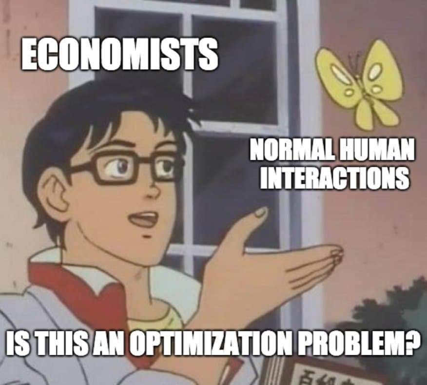
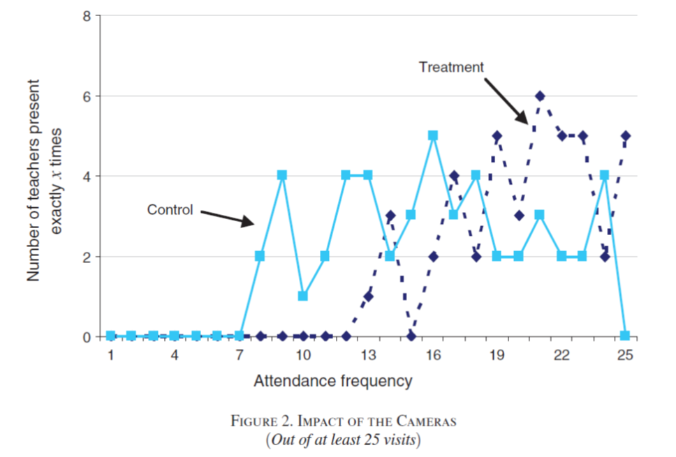
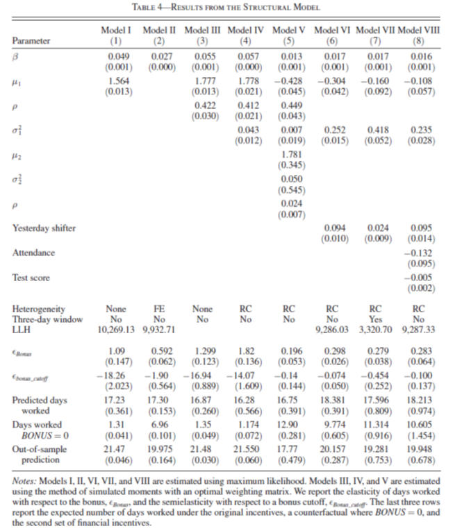
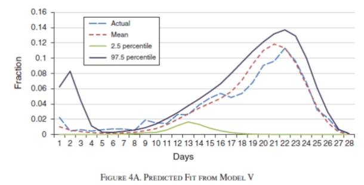
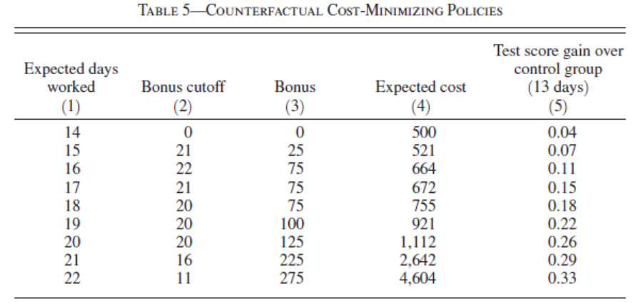

class: title-slide

```{r setup, include=FALSE}
knitr::opts_chunk$set(echo = FALSE, fig.path = "figures/")

library(tidyverse)
library(pacman)
library(janitor)
library(sandwich)
#library(nnet)
#library(mlogit)
library(readr)
library(clubSandwich)
library(modelsummary)
library(estimatr)
library(lubridate)
library(ExPanDaR) #for describing panel data
library(lfe)
library(modelsummary)
library(estimatr)
#library(Matching)
#library(MatchIt)
#library(Zelig)

xfun::pkg_load2(c('base64enc', 'htmltools', 'mime'))
```

```{css, echo = FALSE}
.huge .remark-code { /*Change made here*/
  font-size: 200% !important;
}
.tiny .remark-code { /*Change made here*/
  font-size: 60% !important;
}
```

.title[
# Clase 27. Introducción a modelos econométricos estructurales
]
.subtitle[
## Evaluación de Programas
]
.author[
### Irvin Rojas <br> [rojasirvin.com](https://www.rojasirvin.com/) <br> [<i class="fab fa-github"></i>](https://github.com/rojasirvin) [<i class="fab fa-twitter"></i>](https://twitter.com/RojasIrvin) [<i class="ai ai-google-scholar"></i>](https://scholar.google.com/citations?user=FUwdSTMAAAAJ&hl=en)
]

.affiliation[
### Centro de Investigación y Docencia Económicas <br> División de Economía
]

---

class: inverse, middle, center

# Modelos estructurales

---


# Tipo de modelos usados hasta ahora
 
- Hasta ahora hemos estudiado relaciones de forma reducida
 
- Estudiamos diversos métodos para tratar de identificar el efecto del tratamiento sobre la variable de resultados
 
- Si bien nuestro estudio está guíado por la teoría económica algunas críticas a la forma reducida son

  - Que estos modelos no modelan la toma de decisiones
 
  - Los parámetros no tienen interpretación estructural
 
  - Los parámetros están *confundidos* por los valores de continuación (como veremos más adelante)
 
- A favor de los modelos de forma reducida podemos argumentar que son computacionalmente poco costosos 
 
 
---


# Modelos estructurales
 
- Los modelos estructurales especifican la función objetivo de los agentes
 
- La función objetivo se fundamenta en la teoría económica pero se liga a los datos
 
- Las decisiones y los conjuntos de información de los agentes se hacen explícitos
 
- Se definen también las relaciones entre las variables y las preferencias
 
- Son útiles para cuantificar efectos no solo en el corto plazo sino también en el largo plazo
 
- Podemos comparar los resultados de corto plazo con lo que se obtiene de modelos de forma reducida
 
- Perimiten hacer simulaciones
 
 
---

# Modelos estructurales completamente especificados

 
- Definen las funciones objetivo de los actores
 
- Definen el conjunto de acciones que pueden tomar
 
- Especifican las variables que caracterizan el ambiente económico
 
- La solución al modelo caracteriza las acciones óptimas del individuo en función del ambiente
 
- Este tipo de modelos son el pan de cada día en ramas de la economía como la economía industrial o la economía de la energía y los recursos renovables
 
- En economía, su uso se ha vuelto popular solo recientemente en algunas ramas como la economía laboral y el desarrollo económico 


---


# Ejemplos notables
 
- ¿Cómo responden maestros en India a un programa de incentivos para que asistan a clase?
   
- ¿Cómo afectó PROGRESA las decisiones de asistencia escolar de los niños que recibieron el programa?
   
- ¿Cómo afecta una reforma al sistema de pensiones en Chile a las decisiones de participación en el mercado laboral y las contribuciones?
   
- ¿Cuáles son los retornos de un programa de microcréditos en Tailandia?
   
 
---

# ¿Qué modelar y qué no?
 
- Un modelo estructural caracteriza las decisiones y el ambiente pero también abstrae el problema de la complejidad del mundo real
 
- Cuando se desarrolla un modelo estructural es común caer en la *tentación* de querer incluir demasiado
 
- Debemos tomar decisiones y excluir algunas decisiones y relaciones
 
- Algunas variables se asumen exógeneas y otras se omiten completamente del análisis
 
- Algunos supuestos simplifican el análisis y otros se usan para identificar el modelo
 

---

```{r, out.width="60%", fig.align='center'}

```

---


# Combinación de modelos estructurales con experimentos aleatorios
 
- Hemos estudiado con detalle las bondades de la variación experimental
 
- Este tipo de variación puede explotarse también para estimar modelos estructurales
 
- Pero también el modelo estructural puede servir para validar lo obtenido por métodos experimentales
 
- Veremos un ejemplo muy interesante en el trabajo de Attanasio, Meghir & Santiago (2012) sobre PROGRESA

---

# ¿Qué ganamos y perdemos?

- Ganamos

  - Entendimiento de los mecanismos

  - Diseño de mejores políticas

  - Análisis contrafactuales

- A costa de

  - Recurrimos a muchos supuestos para darle estructura a los problemas

  - Supuestos distribucionales para parámetros de preferencias


---

# Ingredientes
 
- Estructura de las preferencias y mecanismos
 
- **Reglas de decisión**: describen cómo los individuos toman decisiones en respuesta a diferentes realizaciones de las variables de estado
 
- **Variables de estado**: describen el ambiente económico, institucional, natural (exógenas y endógenas)
 
- **Función valor**: mapeo de las decisiones en un valor numérico
 
---

# El concepto de función valor
 
- A cada acción (o conjunto de acciones) se les asocia un valor numérico (la utilidad que implica tomar una decisión) dado un conjunto de variables de estado
 
- Es el nivel de utilidad dada una acción y el valor de las variables de estado
 
- En un problema dinámico la función valor no solo depende de las acciones tomadas hoy sino de las repercusiones que esta decisión tiene para las decisiones futuras
 
 
---

# Estimación de modelos estructurales
 
- La mayoría de los modelos estruturales son en la práctica modelos de optimización no lineales
 
- La estimación de estos modelos es probablemente el costo de entrada más importante
 
- El punto más importante de la estimación es la estimación de funciones valor y las reglas de decisión
 
---


# Métodos de estimación
 
- Máxima verosimilitud

  - Menos común
  
  - Funciona para problemas sencillos
  
  - Especificacr la versomilitud del problema y estimar los parámetros que maximizan la probabilidad de observar los datos
 
- Método de momentos

  - Simular *historias* de acuerdo al comportamiento especificado e incluyendo perturbaciones
  
  - Estimar los parámetros que hacen consistentes los momentos muestrales con momentos observados en los datos
 
 
---


# Comparación entre modelos
 
- Los modelos estructurales y de forma reducida tienen ambos ventajas y desventajas
 
- Un análisis completo combina ambos tipos y describe los resultados obtenidos con distintas metodologías
 
- Los experimentos aleatorios proveen identificación limpiam pero son caros y sirven para probar unas cuantas hipótesis
 
- La combinación de modelos estructurales con variación experimental permite emplear estrategias de validación
 
---

class: middle, center, inverse

# Aplicación: los incentivos funcionan

---

# Que los maestros vayan a la escuela
 
- Duflo, Hanna y Ryan (2012) usan una combinación de modelos estructurales y asignación aleatoria de tratamiento 

- Alto nivel de ausentismo de maestros en la región de Udaipur en India

- Experimento en 120 escuelas (60 tratadas y 60 control)

- Contratos por mínimo 20 días de trabajo

- Tratamiento

  - Una cámara para tomar foto del maestro al inicio y al final del día

- Sistema de incentivos
  
  - Pago fijo de Rs. 1000 en el grupo de control
  - Pago fijo de Rs. 1000 en el grupo de tratamiento más
      - \+ Rs. 50 por cada día adicional asistido en el grupo de tratamiento
      - \- Rs. 50  por cada falta en los 20 días en el grupo de tratamiento
    
---

# Efectos en la asistencia


- Efectivamente, los maestros asistieron más en el grupo de tratamiento (alrededor de 20 pp)

```{r, out.width="55%",fig.cap='Fuente: Duflo, Hanna y Ryan (2012)',fig.align='center'}

```


---

# Incentivos

- Hay dos formas de afectar la asistencia

  - Monitoreo
  
  - Incentivos financieros
  

- Podemos analizar el problema desde el punto de vista puramente experimental

  - Tratamiento con *dos brazos*

- También explotar la estructura no lineal de los pagos

---

# Modelo estructural

- Modelo de oferta laboral

- Diariamente el maestro maximiza

$$U_{tm}=U(C_{tm},L_{tm})=\beta C_{tm}(\pi_m)+(\mu_{tm}-P)L_{tm}$$

- El valor del ocio es estocástico

$$\mu_{tm}=\mu+\epsilon_{tm}$$

- $P$ es el costo no pecuniario de no ir a trabajar

---

# Modelo de los incentivos

- $p_m(t,d)$ es la probabilidad de ser despedido, que depende de los día trabajados $d$ en el momento $t$ de cada mes $m$

- $F$ es el pago si los despiden

- Función de pago en el grupo de tratamiento

$$\pi_m=500+50\max\{0,d_{m-1}-10\}$$

donde $d_{m-1}$ son los días trabajados en un mes

- Para los no tratados el pago es siempre de Rs 1,000 al final del mes

---

# Ecuación de Bellman

- Podemos partir un problema dinámico como la suma del pago contemporáneo más el valor del problema en los periodos restantes

- Para el grupo de control, la **ecuación de Bellman** tiene la siguiente forma

$$
\begin{aligned}
V_m(t,d;\epsilon_{tm})&=p_m(t,d)F+ \\
&(1-p_m(t,d))\times \max\{\mu-P+\epsilon_{tm}+EV_m(t+1,d;\epsilon_{t,m+1}), EV_m(t+1,d+1;\epsilon_{t,m+1})\}
\end{aligned}
$$


- ¿Cómo leemos esta función?

  - Si en el día $t$, cuando llevas acumulados $d$ días, te despiden, te llevas $F$ y eso ocurre con probabilidad $p_m(t,d)$
  
  - Si no te despiden, con probabilidad $(1-p_m(t,d))$, los maestros deciden lo que les de más utilidad de entre
  
    - No ir a trabajar: $\mu-P+\epsilon_{tm}+EV_m(t+1,d;\epsilon_{t,m+1})$
  
    - Ir a trabajar: $EV_m(t+1,d+1;\epsilon_{t,m+1})$


---

# Ecuación de Bellman

- El problema de los maestros en el grupo de tratamiento es algo más complejo

$$
\begin{aligned}
V_m(t,d;\epsilon_{tm})&=p_m(t,d)F+ \\
&(1-p_m(t,d))\times \max\{\mu-\bar{P}+\epsilon_{tm}+EV_m(t+1,d;\epsilon_{t,m+1}), EV_m(t+1,d+1;\epsilon_{t,m+1})\}
\end{aligned}
$$
- En el periodo final


$$
\begin{aligned}
V_m(T_m,d;&\epsilon_{T_m m})=p_m(T_m,d)F+ \\
&(1-p_m(T_m,d))\times\max\{\mu-\bar{P}+\epsilon_{T_m m}+\beta\pi(d)+EV_m(1,0;\epsilon_{t,m+1}),
\beta\pi(d+1)+EV_m(1,0;\epsilon_{t,m+1})\}
\end{aligned}
$$
- En el periodo final importa cuántos días se han acumulado pues esto se traduce en consumo

- Este tipo de problemas se resuelve por *inducción hacia atrás*

  - Empezar en $T_m$ y partir el problema de horizonte infinito en una serie repetida de problemas de horizonte finito

---

# Estimación

- El propósito es estimar los parámetros del modelo
  
  - Cómo el consumo se transforma en utilidad $\beta$
  - El coeficiente sobre el ocio $\mu$


- Se pueden asumir distintos tipos de modelo

  - Donde $\mu$ es común a todos y los errores son iid
  - Donde la asistencia tiene correlación serial en las decisiones y en el error
  - Heterogeneidad en la calidad de maestros
  
  

---

# Coeficientes estimados

.pull-left[
- En los datos, el promedio de días trabajados es 17.16

- Noten que los modelos predicen bien este momento

- $BONUS=1$ simula lo que deberíamos esperar en el grupo de control

- El modelo V predice mejor la asistencia en el grupo de control
]

.pull-right[
```{r, out.width="80%",fig.cap='Fuente: Duflo, Hanna y Ryan (2012)',fig.align='center'}

```
]
---

# Ajuste del modelo


.pull-left[
- El modelo V tiene un buen ajuste con respecto a lo observado en los datos
]
.pull-right[
```{r, out.width="100%",fig.cap='Fuente: Duflo, Hanna y Ryan (2012)',fig.align='center'}

```
]

---

# Simulaciones

.pull-left[
- Una de las ventajas de los modelos estructurales es que nos sirven como un *laboratorio* para simular escenarios contrafactuales

- Cambio: pago mínimo subió a Rs. 700 por trabajar los primeros 12 días

- En los datos la asistencia promedio pasó de 17.16 a 17.39

]

.pull-right[
```{r, out.width="100%",fig.cap='Fuente: Duflo, Hanna y Ryan (2012)',fig.align='center'}

```
]


---

# Conclusión

- Los modelos estructurales son una forma de combinar la teoría y los datos

- Cuando tenemos variación aleatoria, podemos añadir valor al análisis empírico

- Hay un costo de entrada en términos de las técnicas para resolver y estimar los modelos estructurales

- Hay un trade-off entre complejidad y transparencia

---

# Próxima sesión

- Tendremos una presentación sobre modelos estructurales

  - Attanasio, O. P., Meghir, C., & Santiago, A. (2011). Education choices in Mexico: using a structural model and a randomized experiment to evaluate Progresa. *The Review of Economic Studies*, 79(1), 37-66.

---

class: center, middle

Presentación creada usando el paquete [**xaringan**](https://github.com/yihui/xaringan) en R.

El *chakra* viene de [remark.js](https://remarkjs.com), [**knitr**](http://yihui.org/knitr), y [R Markdown](https://rmarkdown.rstudio.com).

Material de clase en versión preliminar.

**No reproducir, no distribuir, no citar.**


