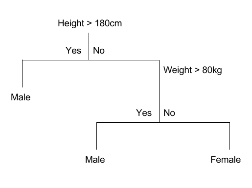
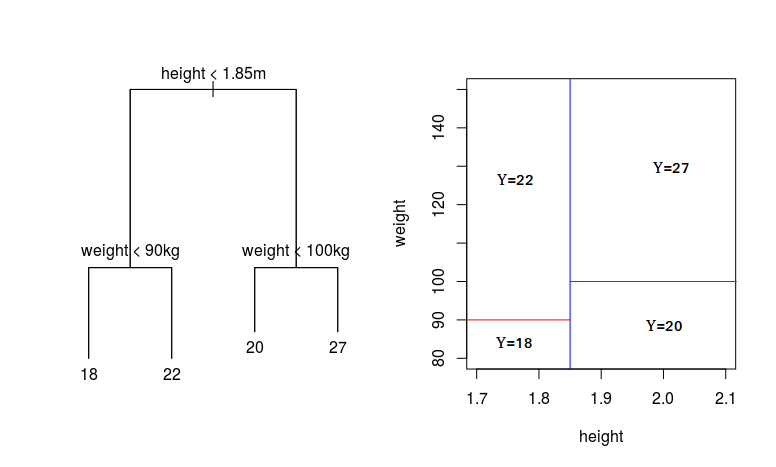
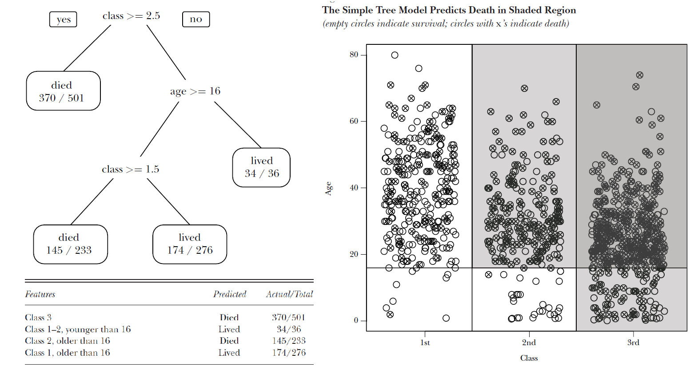
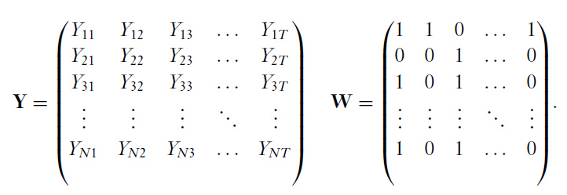
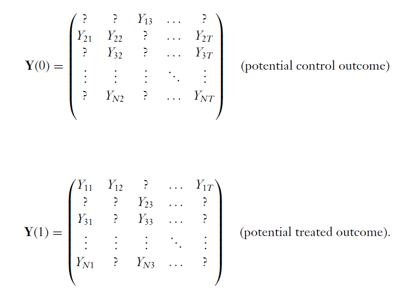
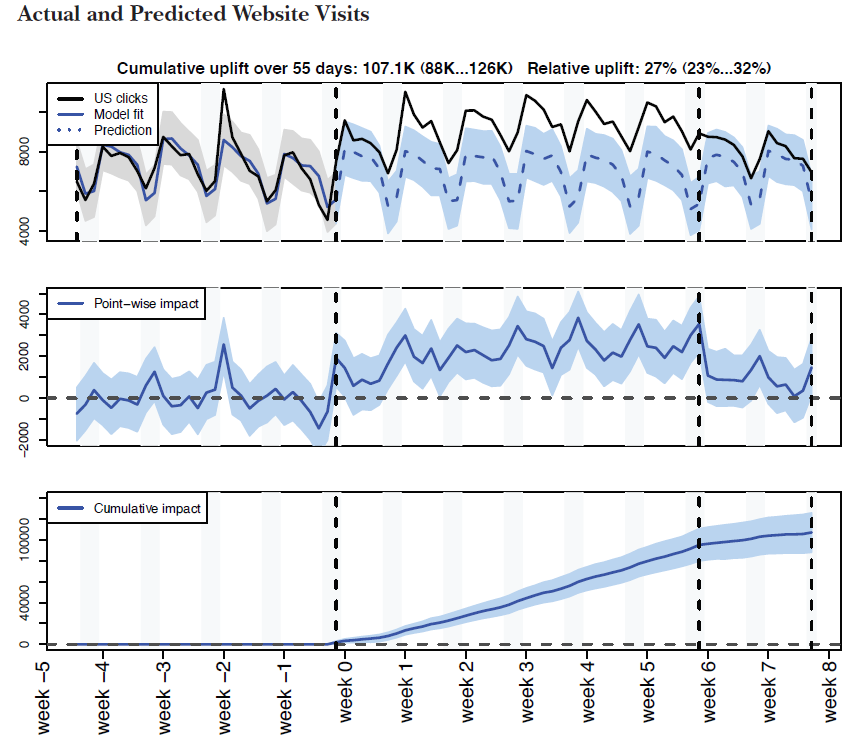

class: title-slide

```{r setup, include=FALSE}
knitr::opts_chunk$set(echo = FALSE, fig.path = "figures/")

library(tidyverse)
xfun::pkg_load2(c('base64enc', 'htmltools', 'mime'))
```

```{css, echo = FALSE}
.huge .remark-code { /*Change made here*/
  font-size: 200% !important;
}
.tiny .remark-code { /*Change made here*/
  font-size: 60% !important;
}
```

.title[
# Clase 29. Aprendizaje automático
]
.subtitle[
## Evaluación de Programas
]
.author[
### Irvin Rojas <br> [rojasirvin.com](https://www.rojasirvin.com/) <br> [<i class="fab fa-github"></i>](https://github.com/rojasirvin) [<i class="fab fa-twitter"></i>](https://twitter.com/RojasIrvin) [<i class="ai ai-google-scholar"></i>](https://scholar.google.com/citations?user=FUwdSTMAAAAJ&hl=en)
]

.affiliation[
### Centro de Investigación y Docencia Económicas <br> División de Economía
]

---

class: inverse, middle, center

# Machine Learning y Big Data

---

# Contraste con los modelos usados hasta ahora
 
- Machine Learning (ML): métodos estadísticos que no asumen un modelo para los datos

- El objetivo principal de ML es la predicción de $y$ usando $x$

- Big Data (BD): conjuntos de datos de gran tamaño, frecuencia y detalle

- ML no es muy funcional con datos estándar

- ML saca el mejor provecho a BD
 
---

# ML avanza más lento en economía
 
- Nos gustan los modelos con ciertas propiedades

--

- ML provee ciertos métodos generales pero se espera que los analistas sean capaces de explotar la particularidad de cada problema
 
- ML tiene muchos menos resultados teóricos generales

---

# ML en economía

- Usamos datos para resolver problemas

- Deberíamos incorporar más herramientas

- En estadística cada vez es más aceptado el uso de ML

- Tenemos una fortaleza adiciónal: tenemos teoría económica

- Podemos adaptar los métodos de la micro aplicada a la disponibilidad de BD y el uso de ML

---

# Objetivos de ML
 
- Supongamos 

$$Y_i|X_i \sim \mathcal{N}(\alpha+X_i'\beta,\sigma^2)$$

- Tradicionalmente usamos MCO

--

- ¿Qué si nos interesa $Y_{N+1}?$

- Definimos

$$\hat{Y}_{N+1}=\hat{\alpha}+X_{N+1}'\hat{\beta}$$
- Planteamos otra función de pérdida

$$(Y_{N+1}-\hat{Y}_{N+1})^2$$
- ¿Cómo obtener $(\hat{\alpha},\hat{\beta})$ con *buenas* propiedades asociadas a esta función de pérdida?
                                             
---

# Términología
                                             
- Datos usados para estimación $\rightarrow$ *muestra de entrenamiento*

- Estimación $\rightarrow$ *entrenamiento*

- Parámetros $\rightarrow$ *pesos*

- $X_i$ $\rightarrow$ *caracaterísticas* o *features*

--

- Observamos $X_i$ y $Y_i$ $\rightarrow$ *aprendizaje supervisado*

- Solo observamos $X_i$ $\rightarrow$ *aprendizaje no supervisado*
                                             
---

# Más terminología
                                             
- Validación: qué tan bien el modelo predice fuera de la muestra

- Escasez: aunque hay muchas características, pocas $X_i$ tienen poder predictivo

- Promedio de modelos: obtener diversos modelos y hacer un promedio ponderado donde los pesos se basan en el poder predictivo fuera de la muestra

- Regulariación: penalizar modelos complejos para prefereir modelos parsimoniosos (que tienen mejor preodicción fuera de la muestra)

  
  
---

class: inverse, middle, center

# Aprendizaje supervisado


---
                                            
# LASSO, cresta y redes elásticas
                                             

- Consideremos la media condicional $g(x)=X_i'\beta$

- $K$ posiblemente grande (inclusive mayor que $N$)

- Regularización: reducir la cantidad de características
		
$$\beta_{q} =\arg 		\min_{\beta}\sum_{i=1}^{N}(Y_i-X_i'\beta)^2+\lambda(||\beta||_q)^{1/q}$$
 
con $||\beta||_q=\sum_{k=1}^{K}|\beta_k|^q$

--

- MCO: $\lambda=0$
- LASSO: $q=1$
- Cresta: $q=2$
 
 
---

# Árboles de regresión (*CART*)
 
- Partir la muestra usando la característica $k$, un nivel $c$ y calcular la media

- Errores antes de partir la muestra:

$$Q= \sum_{i=1}^{N}(Y_i-\bar{Y})^2$$

- Después de partir la muestra:
  
$$Q(k,c)=\sum_{i:X_{ik}\leq c}(Y_i-\bar{Y}_{k,c,l})^2+\sum_{i:X_{ik}>c}(Y_i-\bar{Y}_{k,c,l})^2$$

 
- Optimizar para todos los posibles $k$ y $c$ de tal modo que se minimice el error cuadrado promedio $Q(k,c)$

- Repetir esto para las *hojas* resultantes


---

# Ejemplo de un árbol de regresión
 
```{r, out.width="70%",fig.align='center'}

```

---

# Ejemplo de un árbol de regresión

 
```{r, out.width="70%",fig.align='center'}

```


---

# Ejemplo de un árbol de regresión

```{r, out.width="70%",fig.align='center'}

```

---

# Mejores predicciones

- Añadir aleatoriedad puede ayudar a mejorar predicciones

- *Bootstrap*: escoger con remplazo una muestra de tamaño $n$ para estimar la distribución de un estadístico

- *Bagging*: promediar entre modelos estimados con distintas muestras bootstrap

- *Boosting*: estimar modelos repetidamente dándole cada vez más peso a las observaciones incorrectamente clasificadas y usar una regla para elegir la clasificación final (voyo o promedio entre estimaciones)


---

# Bosques aleatorios
 
- Estimar el mismo árbol de regresión con:

  - Una submuestra bootstrap
  
  - Optimizando con una submuetra aleatoria de características
   
- En vez de predecir $Y_i$ usando un árbol, predecimos usando *bagging* en el bosque
 
 
---

# Aprendizaje profundo y redes neuronales
 
- Útiles con una gran cantidad de características

- $X_{ik}$ se usan para modelar $K_1$ variables latentes no observadas:
  
$$Z_{jk}^{(1)}=\sum_{j=1}^K \beta^{(1)}_{kj}X_{ij}$$
- Y modelamos:
  
$$Y_i=\sum_{k=1}^{K_1}\beta_k^{(2)}g\left[Z_{jk}^{(1)}\right]+\varepsilon_i$$
 
- Esta es una red neuronal con una capa oculta y $K_1$ nodos ocultos

- $g(\cdot)$ es una transformación no lineal que introduce no linealidades en el modelo (como $g(z)=(1+\exp(-z))^{-1}$)
 
---

# *Boosting*
 
- Tomar una predicción, por ejemplo de un árbol

- Crear los residuales $Y_i-\hat{Y}_i^{(1)}$ 

- Usar el error como outcome, empleando el algoritmo original

- Tenemos un nuevo residual $Y_i-\hat{Y}_i^{(2)}$

- Repetir muchas veces 
 
 
---

class: inverse, middle, center

# Aprendizaje no supervisado

---

# Agrupamiento por $K$ medias
 
- No tenemos outcome $Y_i$

- Dadas las características $X_i$, queremos particionar el espacio de características en $K$ subespacios o grupos

- Se eligen *centroides* $b_1,...,b_K$ y se asignan a las unidades a un grupo basados en su cercanía a los centroides

- Comenzar con centroides distribuidos en todo el espacio

- Asignar a las unidades al grupo más cercano

- Actualizar los centroides con el promedio de las características en cada grupo

- Repetir varias veces
 
 
---

class: inverse, middle, center

# ML e inferencia causal

---

# ML en la estimación del ATE
 
- El efecto del tratamiento es:
  
$$
\begin{aligned}
\tau=&E\left[\mu(1,X_i)-\mu(0,X_i)\right] \\
=&E\left(\frac{Y_i W_i}{e(W_i)}-\frac{Y_i (1-W_i)}{1-e(W_i)} \right)
\end{aligned}
$$
- ML puede emplearse para estimar el $PS$ de forma que le otorgue peso a las características con el objetivo de generar balance

- Un poco menos exitoso es usar ML para predecir directamente $\mu(\cdot)$
   
---

# Diseños experimentales
 
- Asignar a muchos individuos a una brazo de tratamiento puede ser ineficiente

- Con variables de respuesta de reacción rápida podemos descartar pronto tratamientos inefectivos

---

# Completamiento de matrices
 
- Supongamos que tenemos resultados observados y estados de tratamiento
- El problema del efecto de tratamiento consiste en rellenar las matrices contrafactuales no observadas
- Sea $L$ la matriz de valores esperados, entonces:
  
$$Y_{it}=\begin{cases}L_{it}+\varepsilon_{it}  & \mbox{si } W_{it}=1 \\  0  & \mbox{en otro caso }\end{cases}$$
     
- $L=USV'$, con $U$ de $N \times N$, $V$ de $T \times T$ y $S$ de $N \times T$ con rango $R$ y con elementos distintos de cero solo en la diagonal principal

- Problema: estimar el producto $L=USV'$ tal que minimice

$$\min_L\left\{\sum_{(i,t)\in \mathcal{O}}(Y_{it}-L_{it})^2+\lambda||L||_*\right\}$$
---

# Ejemplo de la matriz observada

```{r, out.width="70%",fig.cap='Fuente: Athey e Imbens (2019)',fig.align='center'}

```  
    
---
    
# Ejemplo de matriz a completar

```{r, out.width="60%",fig.cap='Fuente: Athey e Imbens (2019)',fig.align='center'}

```  
        
---
    
# Otras aplicaciones
     
- Control sintético

- Impactos heterogéneos
     
---
    
# Ejemplo: impacto de publicidad en línea
     
- Usar técnicas de ML para modelar las ventas en una serie de tiempo

- Incluso se pueden usar las búsquedas de Google para predecir las ventas

- Implementar la campaña y comparar los valores de ventas predichos con los realizados

- Noten que esto tiene la intuición del control sintético

---

# Ejemplo de predicción en ventas

```{r, out.width="50%",fig.cap='Fuente: Athey e Imbens (2019)',fig.align='center'}

```  
         
---

class: inverse, middle, center

# Conclusión

---

# Incorporar ML y BD en el análisis de impacto

- Gran disponibilidad de datos con mucho detalle

- Gran disponibilidad de datos en internet que pueden consecharse

- Los métodos de ML son extendibles a los métodos experimentales y no experimentales del curso

- Hay ciertos costos, quizás los más grandes en términos de programación

- ML y BD se volverán parte de la caja de herramientas de los economistas y otros científicos sociales

---

# Próxima sesión

- Veremos una aplicación de lo que hemos estudiado hoy

  - Oshri, B., et al. (2018). Infrastructure quality assessment in Africa using satellite imagery and deep learning. In Proceedings of the 24th ACM SIGKDD International Conference on Knowledge Discovery & Data Mining (pp. 616-625).

- Y será nuestra última clase

---

class: center, middle

Presentación creada usando el paquete [**xaringan**](https://github.com/yihui/xaringan) en R.

El *chakra* viene de [remark.js](https://remarkjs.com), [**knitr**](http://yihui.org/knitr), y [R Markdown](https://rmarkdown.rstudio.com).

Material de clase en versión preliminar.

**No reproducir, no distribuir, no citar.**


