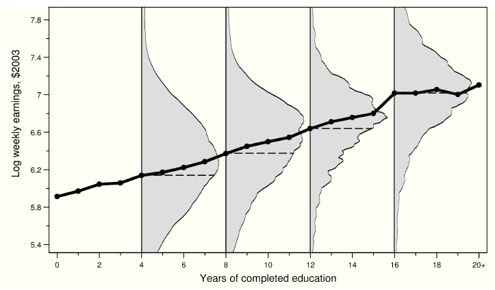
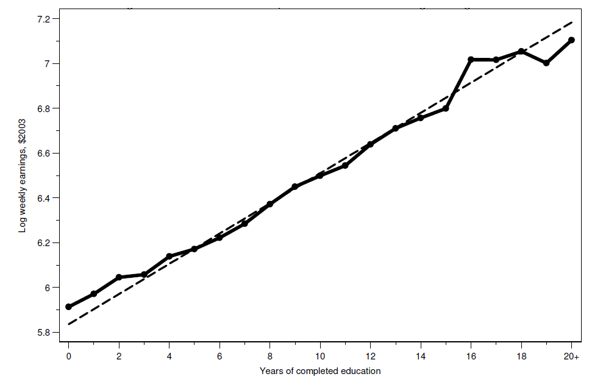

class: title-slide

```{r setup, include=FALSE}
knitr::opts_chunk$set(echo = FALSE, fig.path = "figures/")
library(tidyverse)
library(magick)
library(reticulate)
library(knitr)
library(kableExtra)
xfun::pkg_load2(c('base64enc', 'htmltools', 'mime'))
```

.title[
# Clase 3. Regresión y efectos causales
]
.subtitle[
## Evaluación de Programas
]
.author[
### Irvin Rojas <br> [rojasirvin.com](https://www.rojasirvin.com/) <br> [<i class="fab fa-github"></i>](https://github.com/rojasirvin) [<i class="fab fa-twitter"></i>](https://twitter.com/RojasIrvin) [<i class="ai ai-google-scholar"></i>](https://scholar.google.com/citations?user=FUwdSTMAAAAJ&hl=en)
]

.affiliation[
### Centro de Investigación y Docencia Económicas <br> División de Economía
]

---
# Agenda

1. Motivar el uso de regresión para el análisis de efectos de tratamiento

1. Estudiaremos el supuesto de independencia condicional

1. Veremos un ejemplo de experimento aleatorio para relacionarlo con lo que ya sabemos y para identificar elementos que iremos descubriendo con el tiempo


---

class: inverse, middle, center

# Motivación con efectos constantes


---

# Regresión para la idenfiticación de efectos causales

- Con fines de simplificación, asumamos un efecto de tratamiento constante: $y_{1i}-y_{0i}=\rho$

- Consideremos el valor observado para un individuo 
$$y_i=y_{0i}+(y_{1i}-y_{0i})D_i$$

- Sumemos y restemos $E(y_{0i})$:

$$
\begin{aligned}
y_i&=E(y_{0i})+(y_{1i}-y_{0i})D_i+y_{0i}-E(y_{0i}) \\
&=\underbrace{\alpha}_{E(y_{0i})}+\underbrace{\rho}_{(y_{1i}-y_{0i})} D_i + \underbrace{\nu_i}_{y_{0i}-E(y_{0i})}
\end{aligned}
$$

- Ahora evaluemos:

$$
\begin{aligned}
&E(y|D_i=1)=\alpha+\rho+E(\nu_i|D_i=1) \\
&E(y|D_i=0)=\alpha+E(\nu_i|D_i=0)
\end{aligned}
$$

---

# Regresión para la idenfiticación de efectos causales

- Restando

$$
\begin{aligned}
E(y|D_i=1)-E(y|D_i=0)&=\rho+\overbrace{E(\nu_i|D_i=1)-E(\nu_i|D_i=0)}^{\text{Sesgo de selección}} \\
&=\rho+E(y_{0i}|D_i=1)-E(y_{0i}|D_i=0)
\end{aligned}
$$
- Es decir, el sesgo de selección es igual a la correlación entre el término de error y $D_i$

- Y, de acuerdo a la segunda línea, también es igual a la diferencia en el resultado potencial (de no tratamiento), entre aquellos que son tratados y los que no son tratados

- En nuestro ejemplo del hospital, es muy probable que el sesgo de selección sea negativo porque los tratados son quienes tienen peor salud (en el estado no tratado)

- Como vimos antes, con asignación aleatoria, el sesgo de selección desaparece, por lo que una regresión de $y_i$ en $D_i$ estima el efecto causal $\rho$

---

# Regresión como herramienta

- Usaremos muy frecuentemente la regresión para la estimación de efectos causales

- La interpretación causal de los estimadores no surge de la herramienta, sino del diseño

- Debemos tener en mente siempre si los estimadores están o no libres del sesgo de selección

- Antes vimos que en el experimento STAR las medias de las calificaciones entre grupos eran distintas

- La regresión nos servirá para hacer esencialmente lo mismo: comparación de $y_i$ entre grupos


---

# El impacto de STAR con regresión

La Tabla 2.2.2 en MHE muestra los efectos de tratamiento estimados con regresión: 

$$calificacion_i=\alpha+\beta_1 T_{1i} + \beta_2 T_{2i} + B'X_i + u_i$$

```{r table.star, echo=FALSE, message=FALSE, warnings=FALSE, results='asis'}

variable <- c("`T_1`: Clase pequeña", " ", "`T_2`: Clase pequeña y asistente", " ", "Efectos fijos de escuela", "Controles")
r1 <- c("4.82", "(2.19)", "0.12", "(2.23)","No","No")
r2 <- c("5.37","(1.26)","0.29","(1.13)","Sí","No")
r3 <- c("5.36","(1.21)","0.53","(1.09)","Sí","`X_1`")
r4 <- c("5.37","(1.19)","0.31","(1.07)","Sí","`X_1+X_2`")

table.star <- data.frame(cbind(variable, r1, r2, r3, r4))

colnames(table.star) = c("Variable explicativa","(1)","(2)","(3)","(4)")

table.star %>%
  kbl(align = "lcccc",
      escape = FALSE,
      full_width = FALSE) %>%  kable_paper(c("hover", "condensed", "responsive")) %>%
  add_header_above(c("Efectos experimentales del tamaño del grupo en las calificaciones" = 5 ),
                   bold = TRUE,
                   background = "white") %>% 
  footnote(general = "Tabla 2.2.2 en Angrist y Pischke (2009)",
           general_title = "Nota:",
           footnote_as_chunk = T)
```

---

# El impacto de STAR con regresión

- ¿Cómo se obtienen los resultados de esta tabla?

- ¿Qué se deduce sobre los distintos tratamientos?

- ¿Cuál es la variable dependiente?

- ¿Cuál es la variable independiente clave?

---

# Regresión corta y larga

- Con un tratamiento binario y asignado aleatoriamente, podemos estimar el efecto usando una regresión:

$$y_i=\alpha+\beta T_i + u_i$$

- Es muy común, sin embargo, usar **controles**

- Si una serie de características $X$ no está correlacionada con $T_i$, se puede incluir en una versión larga de la regresión antes descrita:

$$y_i=\alpha+\beta T_i + X_i'\gamma + u_i$$
- El valor numérico de $\hat{\beta}$ en la regresión larga será muy cercano al obtenido con la regresión corta, pero se incrementa la precisión de los parámetros estimados

- Dado que emplearemos regresión ampliamente en este curso, es necesario fijar algunas ideas sobre cómo entendemos y cómo usamos la regresión en la práctica


---

class: inverse, middle, center

# Motivación del uso de regresión en evaluación

---

# Regresión como función de esperanza condicional

- Olvidemos por ahora la causalidad y centremonos en la conexión entre dos variables, $y$ y $s$ (ingreso y educación)

- La **función de esperanza condicional** es una forma de describir la relación entre estas dos variables

- **Función de esperanza condicional**: la FEC de $y_i$ dado un vector de regresores $X_i$ es la esperanza o promedio poblacional de $y_i$ cuando mantenemos fijo $X_i$ y se denota $E(y_i|X_i)$

- Para representar una realización particular de $X_i$ escribimos $X_i=x_i$, por lo que la FEC es $E(y_i|X_i=x_i)$

- Con $y_i$ discreta, la FEC se expresa como

$$E(y_i|X_i=x_i)=\sum_t t P(y_i=t|X_i=x_i)$$
---

# Ejemplo de FEC: salarios y educación en Estados Unidos

.pull-left[
- La figura 3.3.1 en MHE muestra la FEC de salarios en Estados Unidos

- Para cada año de educación, vemos cuál es el (log) del ingreso semanal

- La figura muestra dos cosas principales:

  - La clara relación positiva entre salarios y educación
  
  - La gran variabilidad en salarios para un nivel de educación dado

]


.pull-right[
```{r, out.width="100%",fig.cap='Fuente: Angrist & Pischke (2009)',fig.align='center'}

```
]

---

# Teorema de la regresión de la FEC

- MHE provee varias motivaciones de usar regresión al relacionar la función de regresión con la FEC

- Aquí vamos a rescatar el que considero más intuitivo

- **Teorema de la regresión de la FEC**: la función $X_i'\beta$ es la aproximación lineal de mínimos errores cuadrados promedio de $E(y_i|X_i)$: $$\beta=\arg\min_b E((E(y_i|X_i)-X_i'b) ^2)$$

- Lo que nos dice este teorema es que si yo quiero **aproximar** la FEC y mi criterio para obtener la mejor aproximación es un problema de mínimos cuadrados promedio, entonces lo mejor que puedo hacer es que mi aproximación sea $X'\beta$

---

# Teorema de la regresión de la FEC

- Este teorema nos dice que si pensamos en en aproximar $E(y_i|X_i)$, incluso aunque la FEC no sea lineal, la función de regresión nos da la mejor aproximación lineal

- Este teorema es lo más cercano a como interpretamos la regresión en evaluación pues más que querer predicciones de $y$ para un individuo $i$, nos interesa la relación promedio entre las variables

- Vale la pena notar que aquí hablamos de la función de regresión **poblacional**, es decir, aún tenemos que hablar sobre cómo estimarla


---

# Teorema de la regresión de la FEC

.pull-left[
- La figura 3.1.2 en MHE ilustra este teorema

- La línea sólida es la FEC de la relación años de educación - salario

- La línea sólida muestra los promedios del salario para cada año de educación

- La línea quebrada muestra la línea de regresión usando microdatos

  - Graficar el coeficiente $\beta$ que resulta al correr $y_i=\alpha+\beta s_i+u_i$

- El teorema de la regresion de la FEC dice que obtenemos la misma recta si hacemos una regresión de $E(y_i|s_i)=\alpha+\beta s +u $


]


.pull-right[
```{r, out.width="80%",fig.cap='Fuente: Angrist & Pischke (2009)',fig.align='center'}

```

- Es decir, calculamos las medias del salario para cada nivel de educación y luego se hacemos una regresión de las medias en función de los niveles de educación (dándole más peso a las observaciones que aportaron más datos a la media de cada nivel)
]


---

# Modelos saturados

- Son modelos de regresión donde incluimos una variable categórica para cada uno de los posibles valores que tomen las $X_i$

- Del ejemplo con los datos de EUA, hay 21 posibles años de educación, entonces un modelo saturado es:

$$y_i=\alpha+\beta_1 c_{1i} + \beta_2 c_{2i} + \ldots + \beta_{21} c_{21i} + u_i$$
donde $c_{ji}=1$ si el individuo $i$ tiene una educación $s_{i}=j$

--

- El $j$-ésimo coeficiente $\beta_j$ es el efecto de tener el nivel de educación $j$

- Además, $\alpha=E(y_i|s_i=0)$, se conoce como la categoría omitida

- Podemos escoger la categoría omitida que tenga más sentido

---

# Modelos saturados

- Si tuviéramos dos características, sexo y urbano-rural, un modelo saturado incluye un *término interacción*:


$$y_i=\alpha+\beta_H x_{Hi} + \beta_R x_{Ri}+ \beta_{HR} x_{Hi}x_{Ri}+u_i$$


- A los coeficientes $\beta_H$ y $\beta_U$ se les conoce como *efectos principales*

- El término de interacción $\beta_{HR}$ nos dice cómo cambia el ingreso entre individuos por tipo de localidad y por sexo 

--

- Un modelo saturado, si usamos sexo y $\tau$ categorías de educación, sería:

$$y_i=\alpha+\beta_H x_{Hi}+\sum_{j=1}^{\tau} \beta_j c_{ji} + \sum_{j=1}^{\tau}\beta_{Hj}(x_{Hi}c_{ji})  + u_i$$


---

class: inverse, middle, center

# Regresión y causalidad


---

# Regresión y causalidad

- Lo que hemos visto hasta ahora nos dice que la regresión es nuestro mejor aproximación lineal a la FEC

- Pero la regresión será causal solo si la FEC es causal

- Con lo que hemos visto del modelo de resultados potenciales, podemos tener una interpretación causal de la FEC

--

- La **FEC es causal** cuando describe las diferencias en resultados potenciales promedio para una población de referencia fija (Angrist and Pischke, 2009)

- En la relación entre educación y salarios, una FEC causal describiría lo que un individuo ganaría con distintos niveles de educación

--

- Hay otro caso en el que la regresión puede tener interpretación causal, cuando existe **selección basada en observables**

---

# Supuesto de independencia condicional

- El **supuesto de independencia condicional** significa que, condicional en una serie de características $X_i$, el sesgo de selección desaparece:

$$\{y_{0i},y_{1i}\}\perp D_i | X_i$$

--

- Supongamos que $D_i$ es ir o  no a la universidad y la variable de interés es el ingreso

- Sabemos que la comparación observacional nos da:

$$
\begin{aligned}
E(y_i|D_i=1)-E(y_i|D_i=0)=&\overbrace{ E(y_{1i}-y_{0i}|D_i=1)}^{\text{Efecto promedio en los tratados}}+\\& \underbrace{E(y_{0i}|D_i=1)-E(y_{oi}|D_i=0)}_{\text{Sesgo de selección}}
\end{aligned}
$$

- Es posible que aquellos que no fueron a la universidad de todos modos hubieran tenido un mayor salario, por lo que el sesgo de selección es positivo


---

# Supuesto de independencia condicional

- El SIC implica que si hacemos la comparación condicional en $X_i$, el sesgo desaparece


$$
\begin{aligned}
E(y_i|X_i,D_i=1)-E(y_i|X_i,D_i=0)=E(y_{1i}-y_{0i}|X_i)
\end{aligned}
$$

- Es decir, que si comparamos a personas con y sin tratamiento, con los $X_i$ *fijos*, el sesgo de selección desaparece

- *Mantener fijas* las $X$ es el análogo a obtener el promedio del salario en cada nivel de escolaridad en la gráfica de la FEC descrita anteriormente

---

# Supuesto de independencia condicional

- Para generalizar el concepto cuando la variable tiene más de dos valores (como con la educación $s_i$), escribamos $Y_{si}\equiv f_i(s)$

- Esta función nos dice cuál sería el ingreso de $i$ bajo todos los posibles niveles de $s$

- En este caso, asumimos el SIC, que se traduce en:


$$Y_{si}\perp s_i | X_i$$
- En diseños experimentales, el SIC surge porque el tratamiento se asigna de forma aleatoria

- Pero con datos *observacionales*, el SIC significa que $s_i$ es *casi como si fuera asignado de manera aleatoria* cuando condicionamos en $X_i$

---

# Supuesto de independencia condicional

- En los datos solo observamos $Y_i=f_i(s_i)$


- Dado el SIC, podemos hacer comparaciones de ingreso promedio para distintos niveles de educación:
$$E(Y_i|X_i,s_i=s)-E(Y_i|X_i,s_i=s-1)=E(f_i(s)-f_i(s-1)|X_i)$$
--

- Notemos que lo impráctico de esto es que tendríamos que hacer comparaciones en pares y luego tratar de hacer un promedio ponderado por el número de individuos en cada nivel de educación

---

# Regresión para hacer las comparasiones

- Supongamos una función causal para el ingreso

$$f_i(s)=\alpha+\rho s+\nu_i$$

que indica lo que un individuo ganaría para todo valor de $s$ (y no solo el valor realizado $s_i$)

- La única parte aleatoria es el error con media cero $\nu_i$, que captura los factores no observados que afectan los ingresos

- Sustituyendo el valor observado:
$$Y_i=\alpha+\rho s_i+\nu_i$$
- $s_i$ puede estar correlacionado con los resultados potenciales $f_i(s)$, es decir, correlaciondo con el error $\nu_i$


---

# Regresión para hacer las comparasiones

- Supongamos que el SIC se cumple dado un vector $X_i$

- Descompongamos el error en una función lineal de las características $X_i$ y un error $u_i$:
$$\nu_i=X_i'\gamma+u_i$$

donde se asume que $E(\nu_i|X_i)=X_i'\gamma$ y donde $u_i$ y $X_i$ no están correlacionados

- Si se cumple el SIC, entonces:

$$
\begin{aligned}
E(f_i(s)|X_i,s_i)=E(f_i(s)|X_i)&=\alpha+\rho s+E(\nu_i|X_i) \\
&=\alpha+\rho s + X_i'\gamma
\end{aligned}
$$

- Es decir, en el modelo de regresión causal
$Y_i=\alpha+\rho s_i+ X_i'\gamma+u_i$, $u_i$ no está correlacionado con los regresores $X_i$ y $s_i$

- $\rho$ es el efecto causal de interés

- El supuesto clave es que la única razón por la cual $\nu_i$ y $s_i$ están correlacionados es $X_i$


---

# En resumen

- Las comparaciones observacionales están contaminadas por el sesgo de selección

- La aleatorización resuelve el problema de selección, es decir, al comparar la variable de resultados de interés entre individuos tratados y no tratados, obtenemos el efecto causal

- La FEC nos ayuda a describir la relación entre dos variables, por ejemplo, entre el estado de tratamiento y la variable de resultados

- La regresión es una aproximación lineal a la FEC, aún cuando la FEC no sea lineal

- Usaremos regresión como una herramienta para **comparar** la variable de resultados entre grupos

- La regresión tiene una interpretación causal si la FEC que trata de aproximar es cauusal

- El SIC le da una interpretación causal a la regresión, pero el SIC es un supuesto fuerte


---

class: inverse, middle, center

# Aplicación: efectivo o condicionales


---

# ¿Qué tipo de programa funciona mejor?

- Baird, S., McIntosh, C., & Özler, B. (2011). Cash or condition? Evidence from a cash transfer experiment

- ¿Cuál es la diferencia entre un CCT y un UCT?

- ¿Cuál es la racionalidad económica de los CCT?

  - Fallas de mercado
  
  - Información asimétrica o incompleta
  
  - Factibilidad política
  
- Críticas a los CCT


---

# El experimento ideal

- Si queremos saber qué funciona mejor, ¿cuál es el experimento ideal?

--

- Ya hemos visto varios elementos para interpretar los resultados del trabajo

  - Integridad del diseño
  
  - Efectos de tratamiento usando regresiones

--

- Este artículo contiene muchos elementos que no hemos visto, pero veremos cómo a lo largo del curso nos haremos de herramientas para entender la literatura

  - $z$-scores
  
  - Interpretación de *complidores* y *no cumplidores*
  
  - Errores agrupados

---

# El programa

- ¿En qué consiste?

--
  - Condicionales en el brazo CCT
  
  - Sin requerimientos de asistencia escolar en el brazo UCT
--

- Lugar de implementación: Malawi, distrito de Zomba

- 550 áreas de enumeración (EA) con aproximadamente 250 hogares cada una

--

- ¿A qué nivel se asginó el tratamiento?

--

- Se seleccionaron 176 EA para el estudio: 46 en CCT, 27 en UCT y 88 en C

--

- ¿Quiénes fueron elegibles?
  - Mujeres de 13-22 años
  - Nunca han estado casadas
  - Criterio de escolaridad

---

# Datos

- Encuesta anual para obtener $X$

- En la R2 encuesta a todas las escuelas

- En la R3 encuesta a una submuestra

- Lista de asistencia

- Prueba de matemáticas e ingles en R3

---

# Atrición

- ¿Qué es atrición?


- ¿Qué observamos?


- ¿Cómo se obtienen los resultados de la Tabla 1


---

# Atrición

```{r table.atricion, echo=FALSE, message=FALSE, warnings=FALSE, results='asis'}

variable <- c("", "Condicional", " ", "Incondicional", " ", "Media en grupo de control", "`P>F(Cond.=Incond.)`")
r1 <- c("Entrevistado en ronda 3","0.020","(0.015)","0.021","(0.019)","0.946","0.965")
r2 <- c("Entrevistado en las tres rondas","0.021","(0.030)","0.030","(0.024)","0.893","0.797")
r3 <- c("Tomó prueba de educación", "0.029 *","(0.016)","0.035 *","(0.020)","0.929","0.801")

table.atricion <- data.frame(cbind(variable, r1, r2, r3))

colnames(table.atricion) = c("","(1)","(2)","(3)")

t <- table.atricion %>%
  kbl(align = "lccc",
      escape = FALSE,
      full_width = FALSE) %>%
  kable_paper(c("hover", "condensed", "responsive")) %>%
    add_header_above(c(" "=1, "Variable dependiente:" = 3 ),
                   background = "white") %>% 
    add_header_above(c("Análisis de atrición" = 4 ),
                   bold = TRUE,
                   background = "white") %>% 
  footnote(general = "Adaptado de la tabla 1 de Baird, McIntosh & Ozler (2011). Errores agrupados a nivel EA. La muestra se restringe a individuos que estuvieron en la escuela en la línea base y que fueron seleccionados para estar en uno de los dos grupos de tratamiento o en el grupo de control. Parámetros estimados son distintos de 0 al 99`\\%` (***), 95`\\%` (**) y 90`\\%` (*) de confianza.",
           general_title = "Nota:",
           footnote_as_chunk = T)

scroll_box(t, height="80%")

```


---

# Atrición

- Estimamos la siguiente ecuación por MCO:

$$y_i=\alpha+\beta_C C_i+\beta_U U_i + e_i$$

donde $y_i$ toma el valor de 1 si la observación estaba en la línea base y también en la R3, por ejemplo

--

- ¿Cómo determinamos que hay diferencias significativas?

- Por ejemplo, ¿qué significa el $0.29^*$ (error estándar de 0.016) en la primera fila de la columna (3)?


---

# Pruebas de balance


- Un aspecto que siempre revisamos cuando leemos resultados experimentales

- Verificamos que las características observables antes de la implementación de la intervención sean iguales (en un sentido estadístico) entre los indiviudos asignados a los distintos grupos

- ¿Qué observamos en la tabla 2?


---

# Pruebas de balance


```{r table.balance, echo=FALSE, message=FALSE, warnings=FALSE, results='asis'}


variable <- c("", "Edad", " ","Grado máximo"," ", "Madre vive"," ", "Padre vive"," ", "Nunca tuvo sexo", " ","Embarazada alguna vez"," ", "Transferencia", " ", "N")
control <- c("Control","15.252","(1.903)","7.478","(1.634)","0.842","(0.365)","0.705","(0.456)","0.797","(0.402)","0.023","(0.149)","N/A"," ","1,356")
condicional <- c("Condicional","14.952*","(1.827)","7.246","(1.598)","0.802","(0.399)","0.714","(0.453)","0.797","(0.403)","0.030","(0.171)","3.090","(1.431)", "470")
incondicional <- c("Incondicional","15.424","(1.923)","7.896**","(1.604)","0.836","(0.371)","0.759","(0.428)","0.775","(0.419)","0.031","(0.173)","3.033","(1.451)", "261")
pvalue <- c("Valor `p` (Cond. - Incond.)","0.007***", "", "0.004***","","0.360","","0.288","","0.582","","0.973","","0.606","","")


table.balance <- data.frame(cbind(variable, control, condicional, incondicional, pvalue))

colnames(table.balance) = c("","(1)","(2)","(3)","(4)")

t <- table.balance %>%
  kbl(align = "lcccc",
      escape = FALSE,
      full_width = FALSE) %>%
  kable_paper(c("hover", "condensed", "responsive")) %>%
  add_header_above(c(" " = 1,"Medias"=3, " "=1),
                   background = "white") %>% 
  add_header_above(c("Balance de características individuales" = 5 ),
                   bold = TRUE,
                   background = "white") %>%
  footnote(general = "Adaptado de la tabla 2, panel B, de Baird, McIntosh & Ozler (2011). Errores agrupados a nivel EA. Diferencias de medias distintas de 0 al 99`\\%` (***), 95`\\%` (**) y 90`\\%` (*) de confianza. Los asteriscos en las columnas (2) y (3) indican diferencias significativas con respecto a grupo de control. Los asteriscos en la columna (4) indican diferencias entre los grupos con tratamiento condicional e incondicional.",
           general_title = "Nota:",
           footnote_as_chunk = T)

scroll_box(t, height="80%")

```


---

# Pruebas de balance

- ¿Cómo obtenemos estos resultados en la práctica?

--

$$x_i=\alpha+\beta_C C_i+\beta_U U_i+u_i$$
--

- Otros aspectos técnicos:

  - Errores estándar agrupados a nivel EA
  
  - Indicadores de estrato de aleatorización (ciudad, semiurbano, rural)
  
  
---

# Efectos de tratamiento

- Efectos en la asistencia usando las listas

```{r table.efecto, echo=FALSE, message=FALSE, warnings=FALSE, results='asis'}

variable <- c("", "Condicional", " ", "Incondicional"," ", "Media en control", "N", "`P>F(Cond.=Incond.)`")
t109 <- c("Primer periodo 2009", "0.139***","(0.045)","0.063", "(0.056)","0.778","284","0.129")
t209 <- c("Segundo periodo 2009", "0.014","(0.033)","0.038","(0.033)","0.849","285","0.334")
t309 <- c("Tercer periodo 2009", "0.169**","(0.085)","0.118","(0.102)","0.688","192","0.358")
all09 <- c("Todo 2009","0.080**","(0.035)","0.058","(0.037)","0.810","319","0.436")
t110 <- c("Primer periodo 2010", "0.092**","(0.041)","-0.038","(0.053)","0.801","211","0.010")


table.efecto <- data.frame(cbind(variable, t109, t209, t309, all09, t110))

colnames(table.efecto) = c("","(1)","(2)","(3)","(4)", "(5)")

t <- table.efecto %>%
  kbl(align = "lccccc",
      escape = FALSE,
      full_width = FALSE) %>%
  kable_paper(c("hover", "condensed", "responsive")) %>%
  add_header_above(c(" "=1, "Variable dependiente: fracción de los días que el entrevistado asistió a la escuela"=5),
                   bold = TRUE,
                   background = "white") %>% 
  add_header_above(c("Impactos del programa en la asistencia" = 6 ),
                   bold = TRUE,
                   background = "white") %>%
  footnote(general = "Adaptado de la tabla 5 de Baird, McIntosh & Ozler (2011). Errores agrupados a nivel EA. Se incluyen como controles indicadoras de edad, indicadoras de estrato, el índice de activos del hogar, el grado máximo de estudios y una indicadora de nunca haber tenido sexo. Parámetros estimados estadísticamente distintos de 0 al 99`\\%` (***), 95`\\%` (**) y 90`\\%` (*) de confianza. ",
           general_title = "Nota:",
           footnote_as_chunk = T)

scroll_box(t, height="70%")

```

---

# Efectos de tratamiento

- ¿Cómo obtenemos los efectos de tratamiento?

$$y_i=\alpha+\beta_C C_i+\beta_U U_i +X_i'\gamma+u_i$$
- $X_i$ son las características en la línea base

- Como el tratamiento se asignó de manera aleatoria, esperamos que $X_i$ no esté correlacionado con el error, pero que sí mejore la precisión de los estimadores

---

# Efectos en pruebas académicas

- Muchas veces se emplean *z-scores*

- Supongamos que en un test los alumnos tienen una calificación $y_i$

- Definimos $z_i=\frac{y_i-\bar{y}}{de(y)}$

- Tiene la ventaja de interpretación: $\beta$ es el cambio en desviaciones estándar


---

# Efectos en matrimonios y embarazos

- Efectos grandes en UCT, pero no hay efectos de CCT

- Parece en contra de lo que hubiéramos esperado

- Interpretación basada en *cumplidores* y *no cumplidores*, lo cual veremos más adelante en el curso


---
# Próxima sesión

- Haré un recordatorio de MCO y sus propiedades asintóticas

- Hablaré sobre las medidas de variabilidad para realizar inferencia

  - MM, Capítulo 1, Apéndice
  
- Haré algunas definiciones de la literatura de efectos de tratamiento

  - CT, Capítulo 25, Secciones 1 y 2
  
- Veremos un ejemplo un tanto distinto: un proyecto a escala masiva

  - Banerjee, A., Duflo, E., Goldberg, N., Karlan, D., Osei, R., Parienté, W., Shapiro, J., Thuysbaert, B. & Udry, C. (2015). A multifaceted program causes lasting progress for the very poor: Evidence from six countries. *Science*, 348(6236), 1260799.
  
---

class: center, middle

Presentación creada usando el paquete [**xaringan**](https://github.com/yihui/xaringan) en R.

El *chakra* viene de [remark.js](https://remarkjs.com), [**knitr**](http://yihui.org/knitr), y [R Markdown](https://rmarkdown.rstudio.com).

Material de clase en versión preliminar.

**No reproducir, no distribuir, no citar.**


