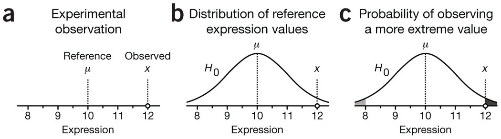
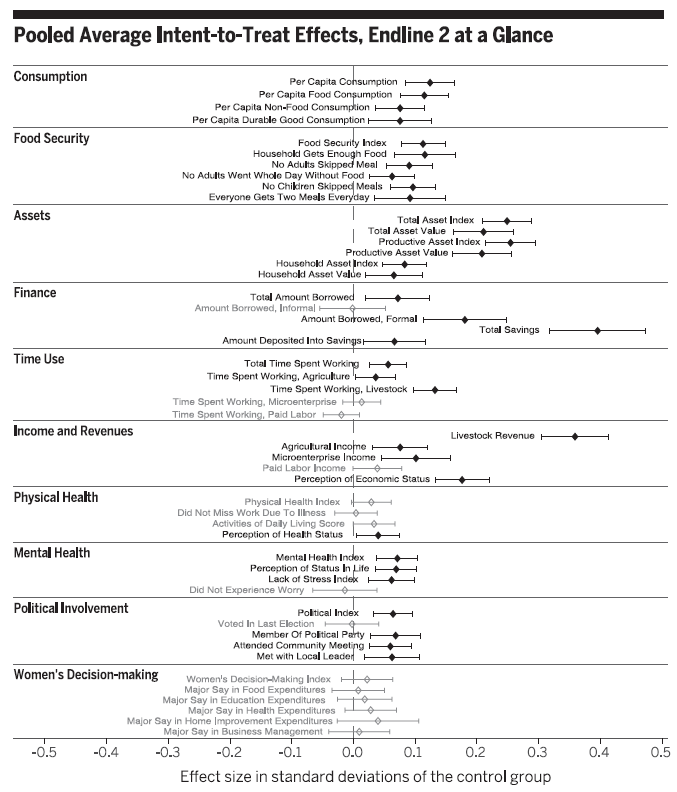

class: title-slide

```{r setup, include=FALSE}
knitr::opts_chunk$set(echo = FALSE, fig.path = "figures/")
library(tidyverse)
library(magick)
library(reticulate)
library(knitr)
library(kableExtra)

xfun::pkg_load2(c('base64enc', 'htmltools', 'mime'))
```

.title[
# Clase 5. Inferencia estadística y evaluación
]
.subtitle[
## Evaluación de Programas
]
.author[
### Irvin Rojas <br> [rojasirvin.com](https://www.rojasirvin.com/) <br> [<i class="fab fa-github"></i>](https://github.com/rojasirvin) [<i class="fab fa-twitter"></i>](https://twitter.com/RojasIrvin) [<i class="ai ai-google-scholar"></i>](https://scholar.google.com/citations?user=FUwdSTMAAAAJ&hl=en)
]

.affiliation[
### Centro de Investigación y Docencia Económicas <br> División de Economía
]

---
# Agenda

1. Definiremos parámetros clave en la literatura de efectos de tratamiento

1. Haremos un breve recordatorio de la *anatomía* y las propiedades del estimador de MCO

1. Estudiaremos medidas de variabilidad de estimadores

1. Estudiaremos una intervención en seis países para enfatizar las características de un experimento aleatorio y el análisis del mismo


---

class: inverse, middle, center

# Parámetros de interés de efectos de tratamiento


---

# Supuesto de independencia condicional

- En la sesión anterior vimos que el SIC nos dice que, condicional en $X_i$, los resultados potenciales son independientes del tratamiento

- Cuando el tratamiento se asigna de manera aleatoria y el diseño experimental se, el supuesto es válido

- Más aún, bajo asignación aleatoria, podemos hacer un supuesto aún más fuerte:

$$\{y_{0i},y_{1i}\perp D_i \}$$

---

# Efectos de tratamiento

- Vamos a definir dos medidas de efecto de tratamiento ampliamente usadas en la literatura

- Definamos el cambio en la variable de resultados de un individuo:

$$\Delta_i=y_{1i}-y_{0i}$$

**Efecto promedio del tratamiento** (ATE): se interpreta como la ganancia hipotética debido al tratamiento para un individuo seleccionado al azar en una población

- Este parámetro es de relevancia cuando pensamos en tratamientos de aplicación universal

- Matemáticamente:

$$ATE=E(\Delta)$$

- Con su correspondiente análogo muestral:
$$\hat{ATE}=\frac{1}{N}\sum_i^N\Delta_i$$

---

# Efectos de tratamiento

**Efecto promedio del tratamiento en los tratados** (ATET, TT, TOT)

- Como su nombre lo dice, este parámetro solo considera a los individuos que son efectivamente tratados

- Matemáticamente:
$$ATET=\frac{1}{N_T}\sum_i^{N_T}(\Delta_i|D_i=1)$$

- Y su análogo muestral es:

$$\hat{ATET}=\frac{1}{N_T}\sum_i^{N_T}(\Delta_i|D_i=1)$$

---

# Efectos de tratamiento

- Heckman (1997) critica el uso del ATE pues pudiera ser irrelevante

- ¿Cuál es el ATE de PROGRESA, por ejemplo?

- La contracrítica es que siempre podemos restringir lo que es la *población* de interés

--

- Noten que el ATET también abre la puerta a casos en los que, aún cuando el tratamiento se asignó aleatoriamente en un grupo, no todos a los que se les asigna el tratamiento efectivamente lo reciben

--

- En ambos casos, no podemos estimar directamente los parámetros pues no observamos $\Delta_i$

- Sin embargo, ya vimos cómo, con una muestra de tratados y no tratados, podemos inferir el efecto del tratamiento, bajo algunos supuestos

---

class: inverse, middle, center

# Breve nota sobre teoría asintótica de MCO


---

# Propiedades del estimador de MCO

- En la práctica, no conocemos la FEC ni la función de regresión poblacional

- En la clase anterior aprendimos que una forma de aproximar la FEC es usando regresión, es decir, quisiéramos conocer $\beta=E(X_iX_i')^{-1}E(X_iy_i)$, un objeto poblacional

- En la práctica aproximamos $\beta$ con su análogo muestral: $\hat{\beta}_{MCO}=(X'X)^{-1}(X'Y)$

--

- Con algo de álgebra, escribimos el estimador de MCO como $$\hat{\beta}_{MCO}=\beta +\left(\sum x_ix_i'\right)^{-1}\left(\sum x_i u_i\right)$$

- Multiplicando por $(1/N)^{-1}(1/N)=1$ el segundo término:
$$\hat{\beta}_{MCO}=\beta +\left(\frac{1}{N}\sum x_ix_i'\right)^{-1}\left(\frac{1}{N}\sum x_i u_i\right)$$
- Esta representación con **promedios** es útil para usar leyes de grandes números (LGN) y teoremas de límite central (TLC)

---

# Consistencia

- Primero mostraremos el resultado de consistencia, es decir, mostraremos que cuando $N\to \infty$, el estimador de MCO $\hat{\beta}_{MCO}$ converge en probabilidad al parámetro poblacional $\beta$

- Esta *prueba* informal de la consistencia nos permitirá ver dónde toma relevancia nuestro supuesto de independencia introducido cuando hablamos de resultados contrafactuales

- Lo que acabaremos mostrando es que una condición necesaria para que $\hat{\beta}_{MCO}$ sea consistente es $E(u_i|x_i)=0$

- En nuestro lenguaje de resultados pontenciales, esto significa que no hay sesgo de selección


---

# Consistencia

- Queremos conocer la probabilidad límite del estimador de MCO:

$$p\lim\hat{\beta}_{MCO}=\beta +\left(p\lim\left(\frac{1}{N}\sum x_ix_i'\right)^{-1}\right)\left(p\lim\left(\frac{1}{N}\sum x_i u_i\right)\right)$$

- Si se puede aplica una LGN a $x_ix_i'$, entonces sabemos que el promedio $\frac{1}{N}\sum x_ix_i'$ converge a una matriz finita no nula

- Entonces, el estimador de MCO es consistente si $p\lim(\frac{1}{N}\sum x_i u_i)=0$

---

# Consistencia

- ¿Qué se requiere para que $p\lim(\frac{1}{N}\sum x_i u_i)=0$?

- Una LGN nos dice que $p\lim(\frac{1}{N}\sum x_i u_i)= E(x_iu_i)$ (asumiendo independencia de las $i$)

- Entonces, necesitamos $E(u_i|x_i)=0$

- Escribimos $\hat{\beta}_{MCO}\xrightarrow{p}\beta$

---

# Distribución límite

- Dada la consistencia, queremos saber la distribución del estimador de MCO para poder hacer inferencia

- ¿Tiene una distribución de la que conocemos sus propiedades?

- ¿Cuál es su media y su varianza cuando $N\to \infty$?

- Para hacer esto, usamos una versión reescalada de $\hat{\beta}$ porque cuando $N\to \infty$?, $\hat{\beta}$ no tiene varianza


---

# Disitribución límite

- Reescribimos el estimador de MCO como:
$$
\begin{aligned}
\sqrt{N}(\hat{\beta}-\beta)&=(N^{-1}X'X)^{-1}(N^{1/2}N^{-1}X'u) \\
&=(N^{-1}X'X)^{-1}(N^{-1/2}X'u)
\end{aligned}
$$

- Para mostrar consistencia ya dijimos que $N^{-1}X'X$ converge a una matriz finita y no nula

- Asumimos que podemos aplicar un TLC a $N^{-1/2}X'u$, el segundo término tiene una distribución asintótica normal con media cero y varianza $p\lim\frac{1}{N}X'uu'X$

--

- El *teorema del límite normal del producto* nos garantiza que también el producto $(N^{-1}X'X)^{-1}(N^{-1/2}X'u)$ será normal y nos dice la forma de la varianza

- Por lo tanto, la distribución asintótica del estimador de MCO es

$$\hat{\beta}_{MCO}\stackrel{a}{\sim}\mathcal{N}\left(\beta,(X'X)^{-1}X'uu'X(X'X)^{-1}\right)$$


---

# Disitribución límite

- Estos son resultados asintóticos, válidos cuando $N\to \infty$

- Son convenientes porque no asumimos forma distribucional sobre los errores

  - En los cursos introductorios de econometría asumiamos, entre otras cosas, errores normales y homocedásticos
  
  - Aquí tenemmos menos supuestos

- La distribución asintótica nos dice que el estimador de MCO tiene una distribución normal y que su varianza depende de los errores

---

# Estimación de la varianza

- Tenemos que estimar también la varianza del estimador de MCO

- En un famoso artículo, White (1980) muestra que podemos estimar consistentemente $\hat{V}(\hat{\beta})$ usando:

 $$\hat{V}(\hat{\beta})=(X'X)^{-1}\left(\sum_i \hat{u}_i^2x_ix_i'\right)(X'X)^{-1}$$
- Esto es a lo que conocemos como la matriz de varianzas robusta a heterocedasticidad

- Son robutos porque no hacemos supuestos sobre la distribución de los errores

- En muy raras ocasiones, si asumimos errores independientes e identicamente distribuidos:

 $$\hat{V}^H(\hat{\beta})=\hat{s}^2(X'X)^{-1}$$
donde $\hat{s}$ es la varianza muestral

---

class: inverse, middle, center

# Medidas de variabilidad

---
# Medidas de variabilidad

- Haremos un breve recordatorio sobre la precisión de los estimadores que usamos para evaluar el efecto de un tratamiento

- Comenzamos con medias pues, como vimos antes, bajo un buen diseño, basta con una diferencia de medias para estimar el efecto del tratamiento

- Sin embargo, las ideas que veremos son fácilmente trasladables a los estimadores de MCO que resultan cuando usamos regresión

---

# Algunas definiciones

- **Insesgadez de la media muestral**: $E(\bar{y})=E(y_i)$

- La insesgadez implica que, si obtuviéramos muestras repetidas de tamaño fijo, no habría desviaciones sistemáticas con respecto a $E(y_i)$

- No confundir con LGN, que implican consistencia cuando $N\to\infty$

- **Varianza poblacional**: $V(y_i)=E((y_i-E(y_i))^2)=\sigma_y^2$

- **Desviación estándar**: $\sigma_y$

- **Varianza muestral**: $S(y_i)^2=\frac{1}{n}\sum_i(y_i-\bar{y})^2$

---

# ¿Cómo medimos la variabilidad de $\bar{y}$

- Asumamos que las $y_i$ son iid

- Por otro lado, reemplazando la definición:

$$
\begin{aligned}
V(\bar{y})&=V\left(\frac{1}{n}\sum_i y_i\right) \\
&=\frac{1}{n^2}V\left(\sum_i y_i\right) \\
&=\frac{1}{n^2}n \sigma^2_y  \\
&=\frac{1}{n}\sigma^2_y 
\end{aligned}
$$
donde la última igualdad resulta de la independencia entre las $i$ y de que dado que las $y_i$ vienen de la misma población, entonces tienen la misma varianza

---

# ¿Cómo medimos la variabilidad de $\bar{y}$

- Notemos que la varianza de la media muestral depende de la varianza de $y_i$, $\sigma^2_y$, pero también de $n$

- Es aquí donde una LGN tiene un papel, pues cuando $n\to\infty$, la varianza de la media muestral tiende a cero

--

- El **error estándar** queda definido como: $SE(\bar{y})=\sigma_y/\sqrt{n}$

- Todos los estimadores que usamos tienen un error estándar, algunos con una forma más complicada que otra, pero todos ellos tienen la misma interpretación: *resumen la variabilidad que surge por el muestreo aleatorio*

--

- La contraparte muestral del error estándar, formalmente llamado **error estándar estimado de la media muestral** es:

$$\hat{SE}(\bar{y})=\frac{S(y_i)}{\sqrt{n}}$$

---

# El estadístico $t$

- Supongamos que queremos probar la hipótesis de que $E(y_i)=\mu$

- El estadístico $t$ se define como:
$$t(\mu)=\frac{\bar{y}-\mu}{\hat{SE}(\bar{y})}$$
- A la hipótesis que queremos probar se le conoce como la hipótesis nula, $H_0$

- Bajo $H_0$: $\mu=0$, el estadístico es $t(\mu)=\frac{\bar{y}}{\hat{SE}(\bar{y})}$

- Un TLC nos garantiza que $t(\mu)$ se distribuye normal en una muestra lo suficientemente grande, sin importar la distribución de $y_i$

- Por tanto, podemos tomar decisiones sobre la $H_0$, basados en si $t(\mu)$ es consistente con lo que esperaríamos ver con una distribución normal

---

# Distribución normal

- La conveniencia de la distribución normal es que conocemos muchas propiedades teóricas de esta

- Por ejemplo, grafiquemos una normal arbitraria con media 0 y desviación estándar 1:

```{r comment='#', echo=TRUE, collapse=TRUE, fig.height=3}
normal_curve <- ggplot(data.frame(x = c(-3, 3)),aes(x = x)) +
  stat_function(fun = dnorm, args= list(0, 1))

funcShaded <- function(x) {y <- dnorm(x, mean = 0, sd = 1)
    y[x < (0 - 1.96 * 1) | x > (0 + 1.96 * 1)] <- NA
    return(y)
}

normal_curve <-normal_curve+stat_function(fun=funcShaded, geom="area", fill="black", alpha=0.2)

```


---

# Distribución normal


.pull-left[
```{r comment='#', echo=FALSE, collapse=TRUE, fig.height=5}
normal_curve
```
]


.pull-right[

- Por ejemplo, sabemos que el 95% de las realizaciones se encuentran en el intervalo $[\mu-1.96\sigma, \mu+1.96\sigma]$

- De aquí surge que, cuando trabajamos al 95% de confianza (típico en economía), se usa una *regla de dedo* de 2 para juzgar el valor de un estadístico $t$

- Un estadístico $t$ mayor que $|2|$ indica que la $H_0$ de que $\mu=0$ es altamente improbable
]

---

# Intervalos de confianza

- En vez de probar si en una muestra la $H_0$ se rechaza o no, para muchos posibles valores de $\mu$, podemos construir el conjunto de todos los valores de $\mu$ que son consistentes con los datos

- A esto le llamamos **intervalo de confianza** de $E(y_i)$

--

- Un intervalo de confianza es el conjunto de valores consistente con los datos:

$$IC_{0.95}=\{\bar{y}-1.96\times\hat{SE}(\bar{y}),\bar{y}+1.96\times\hat{SE}(\bar{y})\}$$
--

- Si tuviéramos acceso a muestras repetidas y en cada una calculáramos $\bar{y}$, esperamos que en el 95% de los casos $E(y_i)$ está en el intervalo de confianza

- Noten que el IC **no** se interpreta como la probabilidad de que el parámetro se encuentre en cierto rango

- La interpretación es más sutil, lo que sucedería si tuviéramos distintas muestras de la misma población

- Regularmente trabajamos con una muestra

---

# Errores estándar del estimador de MCO

- Como vimos anteriormente, el estimador de la matriz de varianzas del estimador de MCO propuesto por White (1980) es:

$$\hat{V}(\hat{\beta}_{MCO})=(X'X)^{-1}\left(\sum_i\hat{u}_i^2x_ix_i'\right)(X'X)^{-1}$$

- El error estándar es $\hat{\beta}_k$ será la raíz cuadrada de la $k$ésima entrada sobre la diagonal principal de $\hat{V}(\hat{\beta}_{MCO})$ y lo denominamos $\hat{EER}(\hat{\beta}_k)$ por venir de una matriz de varianzas robusta

- Con los mismos principios, una estadístico $t$ se define como:

$$t(\beta_k)=\frac{\hat{\beta}_k-\beta_k}{\hat{EER}(\hat{\beta}_k)}$$


---

# Prueba de hipótess

- En la sesión anterior motivamos el uso de regresión para estimar efectos de tratamiento:

$$y_i=\alpha+\beta T_i +\gamma_1 x_1 + \gamma_2 x_2 + \ldots + \gamma_{K-2} x_{K-2}  + u_i$$

- Supongamos que el tratamiento fue asignado aleatoriamente y el diseño permaneció íntegro

- Nos interesa entonces probar la hipótesis nula de que $\beta=0$

--

- Un estadístico $t$ para probar esta hipótesis tiene la forma:

$$t(\beta)=\frac{\hat{\beta}}{\hat{EER}(\hat{\beta})}$$
- Bajo la $H_0$, el estadístico $t$ se distribuye asintóticamente normal

- Podemos comparar el valor $t(\beta)$ con la distribución normal teórica para decir qué tan probable es observar dicho valor del estadístico

---

# El valor $p$

- La otra cara de la moneda de los estadísticos de prueba es el valor $p$

- El valor $p$ es la probabilidad de observar un valor mayor que el estadístico cuando la $H_0$ es verdadera

- Un valor $p$ muy pequeño indica que es muy poco probable observar el estadístico de prueba bajo la $H_0$, por lo que hay evidencia para rechazar la $H_0$

- Otra forma de intepretar el valor $p$ es la probabilidad de que se observen efectos iguales o más grandes a los observados debido al error muestral (*por suerte*)

---

# Valores $p$

- Supongamos que un programa incrementa los ingresos en 100 pesos mensuales en promedio, con un valor $p$ de 0.07

- Entonces, si el programa **no** tuviera efecto, todavía sería posible ver incrementos en los ingresos de 100 pesos mensuales o más en el 7% de los estudios debido al error muestral

- En este breve texto de [Krzywinski & Altman (2013)](https://www.nature.com/articles/nmeth.2698) pueden leer algunos otros detalles sobre el valor $p$

```{r, out.width="80%",fig.cap='Fuente: Krzywinski & Altman (2013)',fig.align='center'}

```


---

# Valores $p$

- ¿Qué tanto toleramos que nuestros resultados puedan ser *por suerte*?

- Fijamos un nivel de significancia $\alpha$, definido como la probabilidad de rechazar la $H_0$ dado que esta es verdadera

- Es decir, la probabilidad de cometer el **error tipo 1** o **falso positivo**

- En economía usamos frecuentemente los valores $\alpha$ de 0.10, 0.05 y 0.01 para juzgar la significancia de los estimadores

- En evaluación, si el valor $p$ es menor que $\alpha$ decimos que el efecto es *estadísticamente significativo*

---

# Prueba de hipótesis en evaluación

- Un camino típico:

  - Formulamos una pregunta causal $D_i \to y_i$

  - Tengo razones para asumir que $D_i$ es independiente de $y_i$ (por ejemplo, hice un experimento)
  
  - De la clase anterior, sé que una regresión me ayudará a hacer comparaciones:
  
  $$y_i=\alpha+\beta D_i + B'X_i + u_i$$
  - Formulamos la $H_0$: $\beta=0$, es decir, no hay efecto del tratamiento
  
  - Estimo la regresión, obtengo $\hat{\beta}$, y construyo $t=\frac{\hat{\beta}}{\hat{se}(\hat{\beta})}$
  
---

# Prueba de hipótesis en evaluación

- ... un camino típico

  - El software me arroja: $\hat{\beta}$, $t(\hat{\beta})$ y $p$

  - $t(\hat{\beta})$ y $p$ son dos caras de la misma moneda
  
  - Si $p>\alpha$, hay una probabilidad de observar $\hat{\beta}$ debido al error muestral mayor que $\alpha$
  
  - O, en términos de $t$, es altamente probable observar el estadístico bajo la $H_0$, por lo que no se rechaza la $H_0$
  
--

- Las hipótesis no son exclusivamente de efectos de tratamiento

- Otras hipótesis:
  - Las características observables están *balanceadas*
  - La atrcición ocurrió al azar

---

class: inverse, middle, center

# Experimentos a escala masiva

---

# Un programa multifacético causa progresos duraderos para los pobres

- Banerjee y una larga lista de coautores (2015)

- Hasta ahora habíamos analizado intervenciones con tratamientos aleatorizados que se restringían a una región o país

--

- Un fenómeno en el corazón del estudio de la economía del desarrollo es identificar las condiciones que provocan que las personas vivan en pobreza y, por tanto, identificar intervenciones que permitan mejorar el nivel de vida de la gente

- ¿Qué piensan? ¿Debemos hacer cosas para combatir la pobreza?

---

# El programa

- Intervención de gran escala en seis países: Etiopía, Ghana, Honduras, India, Pakistán y Perú

- ¿En qué consistió la intervención?

--

- Programa *holístico*

  - Activos
  - Transferencias para comida
  - Entrenamiento para negocios
  - Acompañamiento (*coaching*)
  - Productos de ahorro
  - Educación para la salud
  
---
  
# Diseño

- ¿Cómo se decidió quién recibiría el programa?

--

- En tres países hubo una aleatorización individual

--

  - En cada una de las localidades participantes se eligieron aleatoriamente a los hogares participantes
  
- En otros tres, hubo una aletorización agrupada (*clustered*)

--

  - De las localidades participantes, primero se asignaron localidades a tratamiento y localidades a control
  
  - En las localidades de tratamiento, se aleatorizaron los hogares que recibieron el tratamiento
  
  - Permite identificar la presencia de efectos de derramamiento o *spillovers*
  
---

# Integridad del diseño

- Aquí tenemos dos tablas del [apéndice](https://dspace.mit.edu/bitstream/handle/1721.1/97047/Duflo_A%20multi-faceted%20paper%20and%20SI.pdf?sequence=1&isAllowed=y) del artículo

- ¿A qué equivale la tabla de *ortogonalidad* en el lenguaje que hemos usado hasta ahora?

- ¿Qué nos dice el panel A? ¿Cuál es la $H_0$?

- ¿Qué nos dice el panel B? ¿A qué le ponemos atención aquí?

- ¿Qué se concluye?

---

# Integridad del diseño


```{r table.ortogonal, echo=FALSE, message=FALSE, warnings=FALSE, results='asis'}

variable <- c("", "Panel A: Prueba de diferencia de medias ", "Control", "","Tratamiento","", "Valor `p`", "Panel B: Regresión", "Tratamiento","" ,"`R` cuadrada")

consumo <- c("Consumo per cápita", "", "0.0000", "(0.0124)","-0.0323","(0.0140)","0.0979", "", "-0.0310","(0.020)","0.0000")

seguridad <- c("Índice seguridad alimentaria","","0.0000","(0.0124)","-0.0033","(0.0165)","0.8735","","0.0050","(0.0210)","0.0000")

activos <- c("Índice activos","","0.0000","(0.0124)","0.0277","(0.0188)","0.2019","","0.0180","(0.0220)","0.0010")

table.ortogonal <- data.frame(cbind(variable, consumo, seguridad, activos))

colnames(table.ortogonal) = c("","(1)","(2)","(3)")

t <- table.ortogonal %>%
  kbl(align = "lccc",
      escape = FALSE,
      full_width = FALSE) %>%
  kable_paper(c("hover", "condensed", "responsive")) %>%
    add_header_above(c("Ortogonalidad" = 4 ),
                   bold = TRUE,
                   background = "white") %>% 
  footnote(general = "Apéndice en Banerjee et al. (2015).",
           general_title = "Nota:",
           footnote_as_chunk = T)

scroll_box(t, height="80%")

```


---

# Integridad del diseño

- ¿Cómo interpretamos los resultados sobre atrición presentados?

- ¿Cuál es la $H_0$ en cada panel?

```{r table.atricion, echo=FALSE, message=FALSE, warnings=FALSE, results='asis'}

variable <- c("", "Panel A", "Tratamiento","","Media","Panel B","Tratamiento","","Consumo per cápita","","Índice activos","","Índice salud mental","","Panel C","Tratamiento","","Características línea base", "Características línea base x Tratamiento","Media atrición","Valor `p`")

e1 <- c("Ronda 1","","0.0079","(0.0054)","0.940","","0.0073","(0.0054)","0.0000","(0.0030)","0.0068***","(0.0023)","0.0000","(0.0028)","","0.0087","(0.0069)","Sí","Sí","0.94","0.75")
e2 <- c("Ronda 2","","0.0095","(0.0060)","0.91","","0.0090","(0.0060)","0.0000","(0.0030)","0.0080***","(0.0025)","-0.0065**","(0.0032)","","0.0091","(0.0078)","Sí","Sí","0.91","0.17")


table.atricion <- data.frame(cbind(variable, e1, e2))

colnames(table.atricion) = c("","(1)","(2)")

t <- table.atricion %>%
  kbl(align = "lccc",
      escape = FALSE,
      full_width = FALSE) %>%
  kable_paper(c("hover", "condensed", "responsive")) %>%
    add_header_above(c(" " = 1,"Variable dependiente: encuesta completada" = 2 ),
                   bold = TRUE,
                   background = "white") %>% 
    add_header_above(c("Atrición" = 3 ),
                   bold = TRUE,
                   background = "white") %>% 
  footnote(general = "Apéndice en Banerjee et al. (2015).",
           general_title = "Nota:",
           footnote_as_chunk = T)

scroll_box(t, height="60%")

```

---

# Integridad del diseño

- ¿A se refiere el término cumplimiento o *complience*?

- ¿Qué significa que la tasa de cumplimiento en India sea de 52%?

--

- ¿Por qué se dice que el análisis presentado es uno de intención de tratamiento (*intention to treat*, ITT)

--

- Se comparan hogares **asignados** al tratamiento con hogares asignados al control, sin importar si efectivamente lo recibieron o no


---

# Efectos de tratamiento

- Se estima una sola ecuación con todas las observaciones para cada variable de interés

$$Y^k_i=\alpha + \beta_1 T_i + \beta Z_i^k + P_i + S_i + E_i + \varepsilon_i$$

- $T_i$ es el indicador de asignación al tratamiento

- $Z_i$ es el valor de la variable de interés en la línea base

- $P_i$ son variables indicadoras por país

- $S_i$ son variables indicadoras de si la encuesta fue una encuesta *corta*

- $E_i$ son variables indicadores de estratificación 

---

# Variable dependiente

- ¿Cómo se construye $Y^k_i$?

--

- Consideremos primero una sola variable, digamos el consumo per capita de comida

- Esto es $Y^{k}_{ijl}$ del hogar $i$ en el país $l$ y donde $k=\text{consumo de alimentos}$

- La variable consumo de comida es parte de la familia de consumo $j=consumo$

- Se construye un $z$-*score* para cada variable restándole la media del grupo de control en la ronda en donde se evalúa el impacto en el país $l$ y se le divide por la desviación estándar

--

- En seguida, para cada familia $j$, tomamos los $z$-*score* de las variables que pertenecen a dicha familia y obtenemos la media y la desviación estándar para cada país $l$ y ronda

- Finalmente $Y^k_i$ resulta de estandarizar cada $Y^{k}_{ijl}$


---

# Efectos de tratamiento


.pull-left[
- ¿Cuál es la evidencia (tabla o gráfica) más importante que resume los efectos del programa?

- ¿Qué se encuentra?
]

--

.pull-right[
```{r, out.width="85%",fig.cap='Fuente: Banerjee et al. (2015)',fig.align='center'}

```
]

---

# Efectos de derramamiento

- ¿Cómo podemos identificar los efectos de derramamiento en los países en donde hubo localidades enteras sin ningún hogar tratado?

- En los casos de Ghana, Honduras y Perú hay tres tipos de hogares:

  - Tratados en localidades tratadas
  
  - No tratados en localidades tratadas
  
  - No tratado en localidades no tratadas (control)

--

- Podemos comparar a los no tratados en las localidades de tratamiento con los no tratados en las localidades de control


---
# Próxima sesión

- Estudiaremos con detalle lo que sucede cuando no hay cumplimiento perfecto

  - MM Capítulo 3
  
  - Angrist, J. D. (2006). Instrumental variables methods in experimental criminological research: what, why and how. *Journal of Experimental Criminology*, 2(1), 23-44.
  
---

class: center, middle

Presentación creada usando el paquete [**xaringan**](https://github.com/yihui/xaringan) en R.

El *chakra* viene de [remark.js](https://remarkjs.com), [**knitr**](http://yihui.org/knitr), y [R Markdown](https://rmarkdown.rstudio.com).

Material de clase en versión preliminar.

**No reproducir, no distribuir, no citar.**


