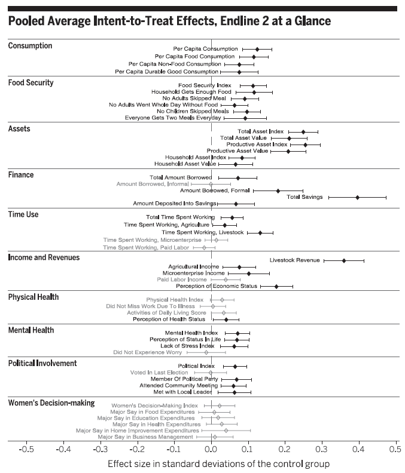

class: title-slide

```{r setup, include=FALSE}
knitr::opts_chunk$set(echo = FALSE, fig.path = "figures/")
library(tidyverse)
library(magick)
library(reticulate)
library(knitr)
library(kableExtra)

xfun::pkg_load2(c('base64enc', 'htmltools', 'mime'))
```

.title[
# Clase 6. Parámetros de interés 
]
.subtitle[
## Evaluación de Programas
]
.author[
### Irvin Rojas <br> [rojasirvin.com](https://www.rojasirvin.com/) <br> [<i class="fab fa-github"></i>](https://github.com/rojasirvin) [<i class="fab fa-twitter"></i>](https://twitter.com/RojasIrvin) [<i class="ai ai-google-scholar"></i>](https://scholar.google.com/citations?user=FUwdSTMAAAAJ&hl=en)
]

.affiliation[
### Centro de Investigación y Docencia Económicas <br> División de Economía
]

---
# Agenda

1. Definiremos parámetros clave en la literatura de efectos de tratamiento

1. Estudiaremos una intervención en seis países para enfatizar las características de un experimento aleatorio y el análisis del mismo

---

class: inverse, middle, center

# Parámetros de interés de efectos de tratamiento

---

# Supuesto de independencia condicional

- En la sesión anterior vimos que el SIC nos dice que, condicional en $X_i$, los resultados potenciales son independientes del tratamiento

- Cuando el tratamiento se asigna de manera aleatoria y el diseño experimental se, el supuesto es válido

- Más aún, bajo asignación aleatoria, podemos hacer un supuesto aún más fuerte:

$$\{y_{0i},y_{1i}\perp D_i \}$$

---

# Efectos de tratamiento

- Vamos a definir dos medidas de efecto de tratamiento ampliamente usadas en la literatura

- Definamos el cambio en la variable de resultados de un individuo:

$$\Delta_i=y_{1i}-y_{0i}$$

**Efecto promedio del tratamiento** (ATE): se interpreta como la ganancia hipotética debido al tratamiento para un individuo seleccionado al azar en una población

- Este parámetro es de relevancia cuando pensamos en tratamientos de aplicación universal

- Matemáticamente:

$$ATE=E(\Delta)$$

- Con su correspondiente análogo muestral:
$$\hat{ATE}=\frac{1}{N}\sum_i^N\Delta_i$$

---

# Efectos de tratamiento

**Efecto promedio del tratamiento en los tratados** (ATET, TT, TOT)

- Como su nombre lo dice, este parámetro solo considera a los individuos que son efectivamente tratados

- Matemáticamente:
$$ATET=E(\Delta_i|D_i=1)$$

- Y su análogo muestral es:

$$\hat{ATET}=\frac{1}{N_T}\sum_i^{N_T}(\Delta_i|D_i=1)$$

---

# Efectos de tratamiento

- Heckman (1997) critica el uso del ATE pues pudiera ser irrelevante

- ¿Cuál es el ATE de PROGRESA, por ejemplo?

- La contracrítica es que siempre podemos restringir lo que es la *población* de interés

--

- Noten que el ATET también abre la puerta a casos en los que, aún cuando el tratamiento se asignó aleatoriamente en un grupo, no todos a los que se les asigna el tratamiento efectivamente lo reciben

--

- En ambos casos, no podemos estimar directamente los parámetros pues no observamos $\Delta_i$

- Sin embargo, ya vimos cómo, con una muestra de tratados y no tratados, podemos inferir el efecto del tratamiento, bajo algunos supuestos

- Nuestras afirmaciones siempre irán acompañadas de una *medida de incertidumbre* debido al error muestral

---

class: inverse, middle, center

# Experimentos a escala masiva

---

# Un programa multifacético causa progresos duraderos para los pobres

- Banerjee y una larga lista de coautores (2015)

- Hasta ahora habíamos analizado intervenciones con tratamientos aleatorizados que se restringían a una región o país

--

- Un fenómeno en el corazón del estudio de la economía del desarrollo es identificar las condiciones que provocan que las personas vivan en pobreza y, por tanto, identificar intervenciones que permitan mejorar el nivel de vida de la gente

- ¿Qué piensan? ¿Debemos hacer cosas para combatir la pobreza?

---

# El programa

- Intervención de gran escala en seis países: Etiopía, Ghana, Honduras, India, Pakistán y Perú

- ¿En qué consistió la intervención?

--

- Programa *holístico*

  - Activos
  - Transferencias para comida
  - Entrenamiento para negocios
  - Acompañamiento (*coaching*)
  - Productos de ahorro
  - Educación para la salud
  
---
  
# Diseño

- ¿Cómo se decidió quién recibiría el programa?

--

- En tres países hubo una aleatorización individual

--

  - En cada una de las localidades participantes se eligieron aleatoriamente a los hogares participantes
  
- En otros tres, hubo una aletorización agrupada (*clustered*)

--

  - De las localidades participantes, primero se asignaron localidades a tratamiento y localidades a control
  
  - En las localidades de tratamiento, se aleatorizaron los hogares que recibieron el tratamiento
  
  - Permite identificar la presencia de efectos de derramamiento o *spillovers*
  
---

# Integridad del diseño

- Aquí tenemos dos tablas del [apéndice](https://dspace.mit.edu/bitstream/handle/1721.1/97047/Duflo_A%20multi-faceted%20paper%20and%20SI.pdf?sequence=1&isAllowed=y) del artículo

- ¿A qué equivale la tabla de *ortogonalidad* en el lenguaje que hemos usado hasta ahora?

- ¿Qué nos dice el panel A? ¿Cuál es la $H_0$?

- ¿Qué nos dice el panel B? ¿A qué le ponemos atención aquí?

- ¿Qué se concluye?

---

# Integridad del diseño


```{r table.ortogonal, echo=FALSE, message=FALSE, warnings=FALSE, results='asis'}

variable <- c("", "Panel A: Prueba de diferencia de medias ", "Control", "","Tratamiento","", "Valor `p`", "Panel B: Regresión", "Tratamiento","" ,"`R` cuadrada")

consumo <- c("Consumo per cápita", "", "0.0000", "(0.0124)","-0.0323","(0.0140)","0.0979", "", "-0.0310","(0.020)","0.0000")

seguridad <- c("Índice seguridad alimentaria","","0.0000","(0.0124)","-0.0033","(0.0165)","0.8735","","0.0050","(0.0210)","0.0000")

activos <- c("Índice activos","","0.0000","(0.0124)","0.0277","(0.0188)","0.2019","","0.0180","(0.0220)","0.0010")

table.ortogonal <- data.frame(cbind(variable, consumo, seguridad, activos))

colnames(table.ortogonal) = c("","(1)","(2)","(3)")

t <- table.ortogonal %>%
  kbl(align = "lccc",
      escape = FALSE,
      full_width = FALSE) %>%
  kable_paper(c("hover", "condensed", "responsive")) %>%
    add_header_above(c("Ortogonalidad" = 4 ),
                   bold = TRUE,
                   background = "white") %>% 
  footnote(general = "Apéndice en Banerjee et al. (2015).",
           general_title = "Nota:",
           footnote_as_chunk = T)

scroll_box(t, height="80%")

```


---

# Integridad del diseño

- ¿Cómo interpretamos los resultados sobre atrición presentados?

- ¿Cuál es la $H_0$ en cada panel?

```{r table.atricion, echo=FALSE, message=FALSE, warnings=FALSE, results='asis'}

variable <- c("", "Panel A", "Tratamiento","","Media","Panel B","Tratamiento","","Consumo per cápita","","Índice activos","","Índice salud mental","","Panel C","Tratamiento","","Características línea base", "Características línea base x Tratamiento","Media atrición","Valor `p`")

e1 <- c("Ronda 1","","0.0079","(0.0054)","0.940","","0.0073","(0.0054)","0.0000","(0.0030)","0.0068***","(0.0023)","0.0000","(0.0028)","","0.0087","(0.0069)","Sí","Sí","0.94","0.75")
e2 <- c("Ronda 2","","0.0095","(0.0060)","0.91","","0.0090","(0.0060)","0.0000","(0.0030)","0.0080***","(0.0025)","-0.0065**","(0.0032)","","0.0091","(0.0078)","Sí","Sí","0.91","0.17")


table.atricion <- data.frame(cbind(variable, e1, e2))

colnames(table.atricion) = c("","(1)","(2)")

t <- table.atricion %>%
  kbl(align = "lccc",
      escape = FALSE,
      full_width = FALSE) %>%
  kable_paper(c("hover", "condensed", "responsive")) %>%
    add_header_above(c(" " = 1,"Variable dependiente: encuesta completada" = 2 ),
                   bold = TRUE,
                   background = "white") %>% 
    add_header_above(c("Atrición" = 3 ),
                   bold = TRUE,
                   background = "white") %>% 
  footnote(general = "Apéndice en Banerjee et al. (2015).",
           general_title = "Nota:",
           footnote_as_chunk = T)

scroll_box(t, height="60%")

```

---

# Integridad del diseño

- ¿A se refiere el término cumplimiento o *complience*?

- ¿Qué significa que la tasa de cumplimiento en India sea de 52%?

--

- ¿Por qué se dice que el análisis presentado es uno de intención de tratamiento (*intention to treat*, ITT)

--

- Se comparan hogares **asignados** al tratamiento con hogares asignados al control, sin importar si efectivamente lo recibieron o no


---

# Efectos de tratamiento

- Se estima una sola ecuación con todas las observaciones para cada variable de interés

$$Y^k_i=\alpha + \beta_1 T_i + \beta Z_i^k + P_i + S_i + E_i + \varepsilon_i$$

- $T_i$ es el indicador de asignación al tratamiento

- $Z_i$ es el valor de la variable de interés en la línea base

- $P_i$ son variables indicadoras por país

- $S_i$ son variables indicadoras de si la encuesta fue una encuesta *corta*

- $E_i$ son variables indicadores de estratificación 

---

# Variable dependiente

- ¿Cómo se construye $Y^k_i$?

--

- Consideremos primero una sola variable, digamos el consumo per capita de comida

- Esto es $Y^{k}_{ijl}$ del hogar $i$ en el país $l$ y donde $k=\text{consumo de alimentos}$

- La variable consumo de comida es parte de la familia de consumo $j=consumo$

- Se construye un $z$-*score* para cada variable restándole la media del grupo de control en la ronda en donde se evalúa el impacto en el país $l$ y se le divide por la desviación estándar

--

- En seguida, para cada familia $j$, tomamos los $z$-*score* de las variables que pertenecen a dicha familia y obtenemos la media y la desviación estándar para cada país $l$ y ronda

- Finalmente $Y^k_i$ resulta de estandarizar cada $Y^{k}_{ijl}$


---

# Efectos de tratamiento


.pull-left[
- ¿Cuál es la evidencia (tabla o gráfica) más importante que resume los efectos del programa?

- ¿Qué se encuentra?
]

--

.pull-right[
```{r, out.width="85%",fig.cap='Fuente: Banerjee et al. (2015)',fig.align='center'}

```
]

---

# Efectos de derramamiento

- ¿Cómo podemos identificar los efectos de derramamiento en los países en donde hubo localidades enteras sin ningún hogar tratado?

- En los casos de Ghana, Honduras y Perú hay tres tipos de hogares:

  - Tratados en localidades tratadas
  
  - No tratados en localidades tratadas
  
  - No tratado en localidades no tratadas (control)

--

- Podemos comparar a los no tratados en las localidades de tratamiento con los no tratados en las localidades de control


---
# Próxima sesión

- Un laboratorio en R sobre regresión y métodos experimentales

  - Será muy útil si le echan un ojo a la Tarea 1
  

- El jueves hablaré sobre cómo estimar el LATE usando variables instrumentales

  - Angrist, J. D. (2006). Instrumental variables methods in experimental criminological research: what, why and how. *Journal of Experimental Criminology*, 2(1), 23-44.

---

class: center, middle

Presentación creada usando el paquete [**xaringan**](https://github.com/yihui/xaringan) en R.

El *chakra* viene de [remark.js](https://remarkjs.com), [**knitr**](http://yihui.org/knitr), y [R Markdown](https://rmarkdown.rstudio.com).

Material de clase en versión preliminar.

**No reproducir, no distribuir, no citar.**


